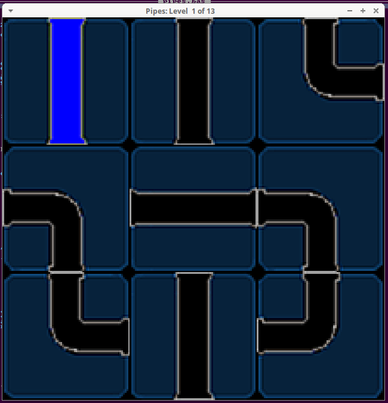

[Home](https://qb64.com) • [News](../../news.md) • [GitHub](https://github.com/QB64Official/qb64) • [Wiki](https://github.com/QB64Official/qb64/wiki) • [Samples](../../samples.md) • [InForm](../../inform.md) • [GX](../../gx.md) • [QBjs](../../qbjs.md) • [Community](../../community.md) • [More...](../../more.md)

## SAMPLE: PIPES PUZZLE



### Author

[🐝 Dav](../dav.md) 

### Description

```text
'================
 'PIPES.BAS v1.0
 '================
 'Connect the pipes puzzle game
 'Coded by Dav for QB64-GL 1.5 in SEP/2021
     
 'NOTE: Formally called MazeConnect Prototype on the forum.
```

### QBjs

> Please note that QBjs is still in early development and support for these examples is extremely experimental (meaning will most likely not work). With that out of the way, give it a try!

* [LOAD "pipes.bas"](https://qbjs.org/index.html?src=https://qb64.com/samples/pipes-puzzle/src/pipes.bas)
* [RUN "pipes.bas"](https://qbjs.org/index.html?mode=auto&src=https://qb64.com/samples/pipes-puzzle/src/pipes.bas)
* [PLAY "pipes.bas"](https://qbjs.org/index.html?mode=play&src=https://qb64.com/samples/pipes-puzzle/src/pipes.bas)

### File(s)

* [pipes-puzzle.zip](src/pipes-puzzle.zip)
* [pipes.bas](src/pipes.bas)

### Additional Image(s)


🔗 [game](../game.md), [puzzle](../puzzle.md)


<sub>Reference: [qb64forum](https://qb64forum.alephc.xyz/index.php?topic=4233.0) </sub>
