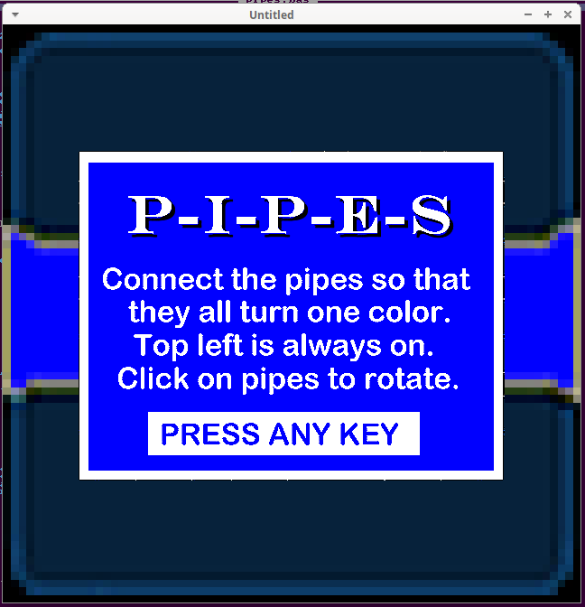

[Home](https://qb64.com) • [News](../../news.md) • [GitHub](../../github.md) • [Wiki](../../wiki.md) • [Samples](../../samples.md) • [Media](../../media.md) • [Community](../../community.md) • [Rolodex](../../rolodex.md) • [More...](../../more.md)

## SAMPLE: PIPES PUZZLE (MAZE CONNECT)


### Author

[🐝 Dav](../dav.md) 

### Description

```text
'================
 'PIPES.BAS v1.0
 '================
 'Connect the pipes puzzle game
 'Coded by Dav for QB64-GL 1.5 in SEP/2021
     
 'NOTE: Formally called MazeConnect Prototype on the forum.
```

### File(s)

* [pipes-puzzle.zip](src/pipes-puzzle.zip)
* [pipes.bas](src/pipes.bas)

### Additional Image(s)



🔗 [game](../game.md), [puzzle](../puzzle.md)


<sub>Reference: [qb64forum](https://qb64forum.alephc.xyz/index.php?topic=4233.0) </sub>
