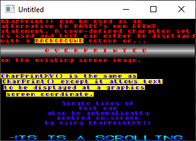

[Home](https://qb64.com) • [News](../../news.md) • [GitHub](https://github.com/QB64Official/qb64) • [Wiki](https://github.com/QB64Official/qb64/wiki) • [Samples](../../samples.md) • [InForm](../../inform.md) • [GX](../../gx.md) • [QBjs](../../qbjs.md) • [Community](../../community.md) • [More...](../../more.md)

## SAMPLE: PIXELPLUS



### Author

[🐝 Chris Chadwick](../chris-chadwick.md) 

### Description

```text
'~~~~~~~~~~~~~~~~~~~~~~~~~~~~~~~~~~~~~~~~~~~~~~~~~~~~~~~~~~~~~~~~~~~~~~~~~~~~
'  PIXELplus 256 User Subroutines & Functions
'  FREEWARE version 1.0 - (C)1995 Chris Chadwick. All rights reserved.
'  For QBASIC, QuickBASIC and Visual BASIC for MS-DOS
'
'  Consult your PIXELplus 256 User's Manual for full details on how to
'  incorporate and use the routines contained in this file.
'
'  Note: The routines contained in this file do not contain error
'        checking. This makes the code easier to understand.
'
'  *** BEFORE RUNNING THE DEMONSTRATION ***
'  Running the demonstration requires access to four files which should have
'  been supplied with this FREEWARE version of PIXELplus 256. They are:
'
'  CHARSET1.PUT
'  CHARSET2.PUT
'  CHARSET3.PUT
'  STANDARD.PAL
'
'  In your PIXELplus 256 directory (usually C:\PP256), the three .PUT files
'  should be located in the IMAGES subdirectory, and the .PAL file should be
'  located in the PALETTES subdirectory. If you have PIXELplus 256
'  installed in a directory other than C:\PP256 then the value of Path$
'  (see (*) below) should be altered appropriately before running the
'  demonstration.
'
'  Note that CHARSET2.PUT is only a partial character set image file that
'  does not include lower case letters so text to be displayed using it
'  should only contain upper case letters.
'
'~~~~~~~~~~~~~~~~~~~~~~~~~~~~~~~~~~~~~~~~~~~~~~~~~~~~~~~~~~~~~~~~~~~~~~~~~~~~
```

### QBjs

> Please note that QBjs is still in early development and support for these examples is extremely experimental (meaning will most likely not work). With that out of the way, give it a try!

* [LOAD "usersubs.bas"](https://qbjs.org/index.html?src=https://qb64.com/samples/pixelplus/src/usersubs.bas)
* [RUN "usersubs.bas"](https://qbjs.org/index.html?mode=auto&src=https://qb64.com/samples/pixelplus/src/usersubs.bas)
* [PLAY "usersubs.bas"](https://qbjs.org/index.html?mode=play&src=https://qb64.com/samples/pixelplus/src/usersubs.bas)

### File(s)

* [pp256img.zip](src/pp256img.zip)
* [usersubs.bas](src/usersubs.bas)

🔗 [graphics](../graphics.md), [bitmap](../bitmap.md)
