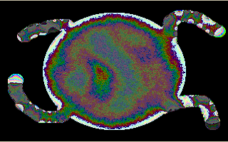

[Home](https://qb64.com) • [News](../../news.md) • [GitHub](https://github.com/QB64Official/qb64) • [Wiki](https://github.com/QB64Official/qb64/wiki) • [Samples](../../samples.md) • [InForm](../../inform.md) • [GX](../../gx.md) • [QBjs](../../qbjs.md) • [Community](../../community.md) • [More...](../../more.md)

## SAMPLE: PLASMA EFFECT



### Author

[🐝 Cyperium](../cyperium.md) 

### Description

```text
Use the left mousebutton to draw a line, change color with the right mousebutton, the middle mousebutton will draw a multicolor circle into the effect.
```

### QBjs

> Please note that QBjs is still in early development and support for these examples is extremely experimental (meaning will most likely not work). With that out of the way, give it a try!

* [LOAD "plasmaeffect.bas"](https://qbjs.org/index.html?src=https://qb64.com/samples/plasma-effect/src/plasmaeffect.bas)
* [RUN "plasmaeffect.bas"](https://qbjs.org/index.html?mode=auto&src=https://qb64.com/samples/plasma-effect/src/plasmaeffect.bas)
* [PLAY "plasmaeffect.bas"](https://qbjs.org/index.html?mode=play&src=https://qb64.com/samples/plasma-effect/src/plasmaeffect.bas)

### File(s)

* [plasmaeffect.bas](src/plasmaeffect.bas)

🔗 [graphics](../graphics.md), [plasma](../plasma.md)
