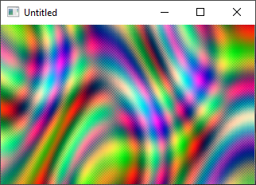

[Home](https://qb64.com) • [News](../../news.md) • [GitHub](https://github.com/QB64Official/qb64) • [Wiki](https://github.com/QB64Official/qb64/wiki) • [Samples](../../samples.md) • [InForm](../../inform.md) • [GX](../../gx.md) • [QBjs](../../qbjs.md) • [Community](../../community.md) • [More...](../../more.md)

## SAMPLE: PLASMA NON-PAL



### Author

[🐝 Relsoft](../relsoft.md) 

### Description

```text
'///Non Palette rotated plasma
'///Relsoft 2003
'///Compile and see the speed.  Didn't optimize it as much as I want though...
```

### QBjs

> Please note that QBjs is still in early development and support for these examples is extremely experimental (meaning will most likely not work). With that out of the way, give it a try!

* [LOAD "npplasma.bas"](https://qbjs.org/index.html?src=https://qb64.com/samples/plasma-non-pal/src/npplasma.bas)
* [RUN "npplasma.bas"](https://qbjs.org/index.html?mode=auto&src=https://qb64.com/samples/plasma-non-pal/src/npplasma.bas)
* [PLAY "npplasma.bas"](https://qbjs.org/index.html?mode=play&src=https://qb64.com/samples/plasma-non-pal/src/npplasma.bas)

### File(s)

* [npplasma.bas](src/npplasma.bas)

🔗 [screensaver](../screensaver.md), [plasma](../plasma.md)
