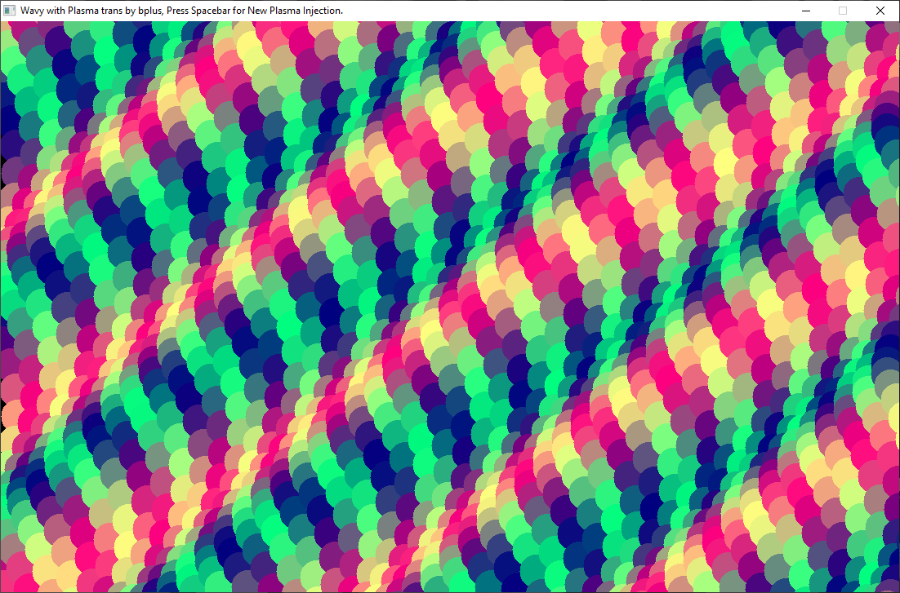

[Home](https://qb64.com) • [News](../../news.md) • [GitHub](https://github.com/QB64Official/qb64) • [Wiki](https://github.com/QB64Official/qb64/wiki) • [Samples](../../samples.md) • [InForm](../../inform.md) • [GX](../../gx.md) • [QBjs](../../qbjs.md) • [Community](../../community.md) • [More...](../../more.md)

## SAMPLE: PLASMA WAVES



### Description

```text
'Wavy with Plama.bas for QB64 fork (B+=MGA) 2017-05-05
' Wavy with Plasma Treatment.bas SmallBASIC 0.12.9 (B+=MGA) 2017-05-03
' from: animated circles started by Admin at SdlBasic 2017-05-03
' I added Plasma treatment and spacebar  changer
Oh, I guess I was experimenting with circle drawing here too.
```

### QBjs

> Please note that QBjs is still in early development and support for these examples is extremely experimental (meaning will most likely not work). With that out of the way, give it a try!

* [LOAD "plasmawaves.bas"](https://qbjs.org/index.html?src=https://qb64.com/samples/plasma-waves/src/plasmawaves.bas)
* [RUN "plasmawaves.bas"](https://qbjs.org/index.html?mode=auto&src=https://qb64.com/samples/plasma-waves/src/plasmawaves.bas)
* [PLAY "plasmawaves.bas"](https://qbjs.org/index.html?mode=play&src=https://qb64.com/samples/plasma-waves/src/plasmawaves.bas)

### File(s)

* [plasmawaves.bas](src/plasmawaves.bas)

🔗 [screensaver](../screensaver.md), [plasma](../plasma.md)


<sub>Reference: [qb64forum](https://qb64forum.alephc.xyz/index.php?topic=27.0) </sub>
