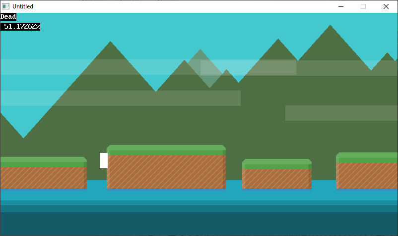
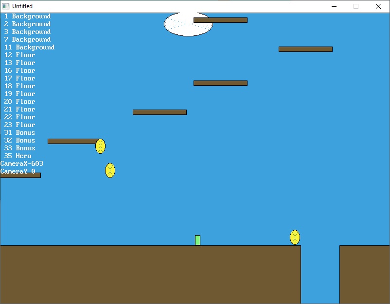

[Home](https://qb64.com) • [News](../../news.md) • [GitHub](https://github.com/QB64Official/qb64) • [Wiki](https://github.com/QB64Official/qb64/wiki) • [Samples](../../samples.md) • [InForm](../../inform.md) • [GX](../../gx.md) • [QBjs](../../qbjs.md) • [Community](../../community.md) • [More...](../../more.md)

## SAMPLE: PLATFORM



### Author

[🐝 Fellippe Heitor](../fellippe-heitor.md) 

### Description

```text
# Platform

What does a 2D platform game take?

Made with QB64.
```

### File(s)

* [mrjumps.bas](src/mrjumps.bas)
* [platform.bas](src/platform.bas)
* [platform.zip](src/platform.zip)

### Additional Image(s)



🔗 [game](../game.md), [platform](../platform.md)


<sub>Reference: [github.com](https://github.com/FellippeHeitor/Platform) </sub>
