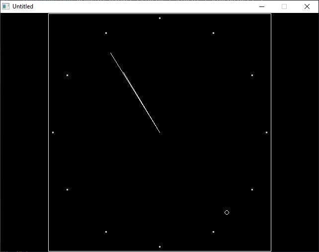

[Home](https://qb64.com) • [News](../../news.md) • [GitHub](https://github.com/QB64Official/qb64) • [Wiki](https://github.com/QB64Official/qb64/wiki) • [Samples](../../samples.md) • [InForm](../../inform.md) • [GX](../../gx.md) • [QBjs](../../qbjs.md) • [Community](../../community.md) • [More...](../../more.md)

## SAMPLE: QB CLOCK



### Author

[🐝 Alan Zeichick](../alan-zeichick.md) 

### Description

```text
' Analog Clock for QBasic
' by Alan Zeichick copyright (c) 1986, 1992
' Copyright (C) 1992 DOS Resource Guide
' Published in Issue #7, January 1993, page 47
'
' This program may be freely given away,
' but may not be sold without the author's
' express written permission.
 
' This program 1. Initializes some global variables.
'              2. Determines what video is installed.
'              3. Sets up video characteristics for this
'                 display type.
'              4. Calculates an analog clock's parameters.
'              5. Displays an analog clock until a key
'                 is pressed.
 
' First, let's initialize global variables which well use as constants.
' Radian is the conversion factor between degree and radian
' measurements. It will be used when calculating hand positions.
' DrawBlack, DrawWhite, and DrawBright are screen colors.

==============================================================================

-------------
 QBCLOCK.BAS
-------------
SYSTEM REQUIREMENTS:
The version of QBasic that comes with DOS 5 or later, or Microsoft Quick Basic 
4.x.

WHAT QBCLOCK.BAS DOES:
This QBasic program displays a large analog clock in the middle of your 
screen. The clock's moving seconds indicator and minute and hour hands keep 
accurate time until you press any key to stop the clock.

USING QBCLOCK.BAS:
To load the program, type QBASIC QBCLOCK.BAS (using path names if necessary) 
at the DOS prompt. Then, run the program by selecting the Start option in 
QBasic's Run menu, or press Shift-F5. To stop the clock, press any key.

For further details on QBCLOCK.BAS, as well as hints for modifying the 
program, see "The Big Clock" (DRG #7, January 1993, page 47).
```

### QBjs

> Please note that QBjs is still in early development and support for these examples is extremely experimental (meaning will most likely not work). With that out of the way, give it a try!

* [LOAD "qbclock.bas"](https://qbjs.org/index.html?src=https://qb64.com/samples/qb-clock/src/qbclock.bas)
* [RUN "qbclock.bas"](https://qbjs.org/index.html?mode=auto&src=https://qb64.com/samples/qb-clock/src/qbclock.bas)
* [PLAY "qbclock.bas"](https://qbjs.org/index.html?mode=play&src=https://qb64.com/samples/qb-clock/src/qbclock.bas)

### File(s)

* [qbclock.bas](src/qbclock.bas)

🔗 [clock](../clock.md)
