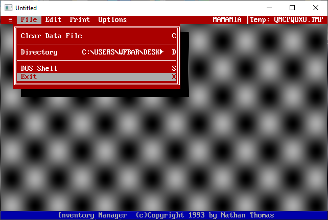

[Home](https://qb64.com) • [News](../../news.md) • [GitHub](../../github.md) • [Wiki](../../wiki.md) • [Samples](../../samples.md) • [Media](../../media.md) • [Community](../../community.md) • [Rolodex](../../rolodex.md) • [More...](../../more.md)

## SAMPLE: QB-NVENTORY



### Author

[🐝 Nathan Thomas](../nathan-thomas.md) 

### Description

```text
# qbasic-nventory
(i)nventory manager written in qbasic!

This is a personal software project from 1993. This was intented just to keep track of an inventory of "things". While the version and release numbers might seem "high" for such a project, I was basically just making them up at that time to be "cool" along with random company names

I remember compiling this to an executable using QB45. Designed to run from the DOS prompt it was just "NVENTORY.EXE"

There are some issues with disk storage, writing seems fine, but reading doesn't appear to be working in data, but it does know how `many` items have been saved.

Here's some screens! Running for the first time in almost 20 years using [qb64]
```

### File(s)

* [nventory.bas](src/nventory.bas)
* [nventory.zip](src/nventory.zip)

🔗 [data management](../data-management.md)
