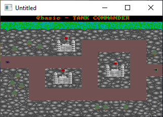

[Home](https://qb64.com) • [News](../../news.md) • [GitHub](../../github.md) • [Wiki](../../wiki.md) • [Samples](../../samples.md) • [Media](../../media.md) • [Community](../../community.md) • [Rolodex](../../rolodex.md) • [More...](../../more.md)

## SAMPLE: QB TANK COMMANDER



### Author

[🐝 Matthew River Knight](../matthew-river-knight.md) 

### Description

```text
'-=-=-=-=-=-=-=-=-=-=-=-=-=-=-=-=-=-=-=-=-=-=-=-=-=-=-=-=-=-=-=-=-=-=-=-=-=-=-
'
'        ±±    ±± ±±±±±± ±±±±±± ±± ±±±±±  ±±±±±± ±±±   ±± ±±±±±±
'        ±±    ±± ±±  ±± ±±  ±± ±±    ±±  ±±  ±± ±± ±± ±± ±±
'        ±±±±±±±± ±±  ±± ±±±±±± ±±   ±±   ±±  ±± ±±  ±±±±  ±±±±
'        ±±    ±± ±±  ±± ±± ±±  ±±  ±±    ±±  ±± ±±   ±±±     ±±
'        ±±    ±± ±±±±±± ±±  ±± ±± ±±±±±± ±±±±±± ±±    ±± ±±±±±
'
'     I N T E R A C T I V E    E N T E R T A I N M E N T  -  1 9 9 9
'
'
'               Game Name:  Qbasic TANK COMMANDER version 2
'                   Programmer:  Matthew River Knight
'                     Completed:  August 15, 1999
'
'
'This game is a remake of the last TANK COMMANDER, having been improved and
'modified a great deal. The sprites now move very fluidly and without any
'flicker on 286 PCs and up. The code is also alot smaller than the last
'version and has been made as readable and easy to edit as possible.
'
'                               * * * *
'
'This is a two player game in which you and a friend drive about the arena
'in tanks trying to blow eachother up. You both have very powerfull tanks
'capable of driving through anything in your path. Even the most secure of
'fortresses stands no chance against these armoured beasts. Each of the tanks
'is equipt with powerfull bomb launchers, capable of blowing up the other
'tank beyond repair, with a single strike.
```

### File(s)

* [tcv2.bas](src/tcv2.bas)
* [tcv2.zip](src/tcv2.zip)

🔗 [game](../game.md), [tank](../tank.md)
