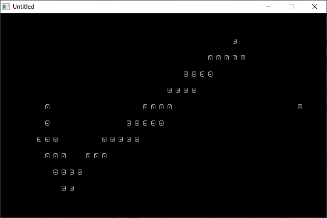

[Home](https://qb64.com) • [News](../../news.md) • [GitHub](../../github.md) • [Wiki](../../wiki.md) • [Samples](../../samples.md) • [Media](../../media.md) • [Community](../../community.md) • [Rolodex](../../rolodex.md) • [More...](../../more.md)

## SAMPLE: QBASCII



### Author

[🐝 Jeremy Munn](../jeremy-munn.md) 

### Description

```text
'*****************************************************************************
' Name:         QBASCII.BAS
' Author:       Jeremy Munn
' Date:         07/28/2012
' Description:  ASCII drawing program with save & load features.
'*****************************************************************************
```

### File(s)

* [qbascii.bas](src/qbascii.bas)

🔗 [drawing](../drawing.md), [ascii](../ascii.md)


<sub>Reference: [github.com](https://github.com/FellippeHeitor/cant-contain-me) </sub>
