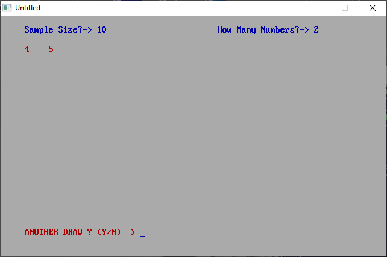

[Home](https://qb64.com) • [News](../../news.md) • [GitHub](https://github.com/QB64Official/qb64) • [Wiki](https://github.com/QB64Official/qb64/wiki) • [Samples](../../samples.md) • [InForm](../../inform.md) • [GX](../../gx.md) • [QBjs](../../qbjs.md) • [Community](../../community.md) • [More...](../../more.md)

## SAMPLE: QBRND



### Author

[🐝 Jeff Davis](../jeff-davis.md) 

### Description

```text
' QBRND.BAS
'   by Jeff Davis
' Copyright (C) 1994 DOS Resource Guide
' Published in Issue #15, May 1994, page 64

***************************************************************************** 
 
 QBRND.BAS 
   by Jeff Davis 
 Copyright (C) 1994 DOS Resource Guide 
 Published in Issue #15, May 1994, page 64 
 
Many QBasic programs, especially games, involve generating random numbers.   
This program handles a variety of random number tasks, and you may want  
incorporate its techniques and subroutines in your own programs. 
 
QBRND.BAS is capable of generating random lotto numbers, generating a  
tournament draw, determining a draft order at random, choosing bingo numbers,  
and more. 
 
To run the program from the DOS command line, change to the directory  
containing QBRND.BAS, then type: 
 
QBASIC /RUN QBRND 
 
 
Instead of limiting the number choices to a range, such as 1 to 100, the  
program asks for the size of the sample and then asks how many times you wish  
to draw from that sample. For a lottery, for instance, you might enter 49 as  
the sample size and 6 as the number of draws; for bingo, good values might be  
75 and 75.
```

### QBjs

> Please note that QBjs is still in early development and support for these examples is extremely experimental (meaning will most likely not work). With that out of the way, give it a try!

* [LOAD "qbrnd.bas"](https://qbjs.org/index.html?src=https://qb64.com/samples/qbrnd/src/qbrnd.bas)
* [RUN "qbrnd.bas"](https://qbjs.org/index.html?mode=auto&src=https://qb64.com/samples/qbrnd/src/qbrnd.bas)
* [PLAY "qbrnd.bas"](https://qbjs.org/index.html?mode=play&src=https://qb64.com/samples/qbrnd/src/qbrnd.bas)

### File(s)

* [qbrnd.bas](src/qbrnd.bas)

🔗 [statistics](../statistics.md), [dos world](../dos-world.md)
