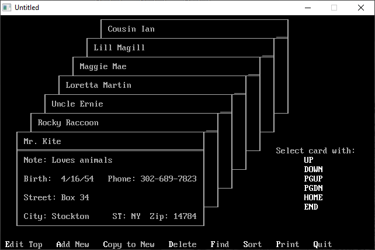

[Home](https://qb64.com) • [News](../../news.md) • [GitHub](../../github.md) • [Wiki](../../wiki.md) • [Samples](../../samples.md) • [Media](../../media.md) • [Community](../../community.md) • [Rolodex](../../rolodex.md) • [More...](../../more.md)

## SAMPLE: QCARDS



### Author

[🐝 Microsoft](../microsoft.md) 

### Description

```text
A simple database using a cardfile user interface by Microsoft.
```

### File(s)

* [qcards.bas](src/qcards.bas)
* [qcards.zip](src/qcards.zip)

🔗 [data management](../data-management.md)
