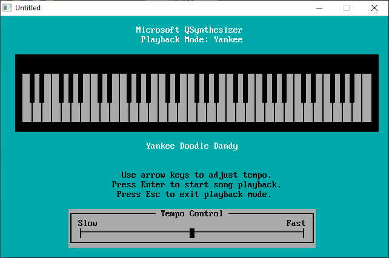

[Home](https://qb64.com) • [News](../../news.md) • [GitHub](https://github.com/QB64Official/qb64) • [Wiki](https://github.com/QB64Official/qb64/wiki) • [Samples](../../samples.md) • [InForm](../../inform.md) • [GX](../../gx.md) • [QBjs](../../qbjs.md) • [Community](../../community.md) • [More...](../../more.md)

## SAMPLE: QSYNTH



### Author

[🐝 Microsoft](../microsoft.md) 

### Description

```text
Audio synthesizer by Microsoft.
```

### File(s)

* [qsynth.bas](src/qsynth.bas)
* [qsynth.dat](src/qsynth.dat)
* [qsynth.zip](src/qsynth.zip)

🔗 [sound](../sound.md), [music](../music.md)
