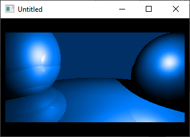

[Home](https://qb64.com) • [News](../../news.md) • [GitHub](../../github.md) • [Wiki](../../wiki.md) • [Samples](../../samples.md) • [Media](../../media.md) • [Community](../../community.md) • [Rolodex](../../rolodex.md) • [More...](../../more.md)

## SAMPLE: RAY TRACER DEMO

### Author

[🐝 Antoni Gual](../antoni-gual.md) 

### Description

'Pure QB Realtime Raytracer Demo
'Translated to/optimized for QB by Antoni Gual agual@eic.ictnet.es
'The original was written in C by Texel, a Spanish demo coder.
'It will not work in the IDE due to integer overflow errors.
'Compile with QB 4.0 or QB4.5 + ffix. It does 12.5 fps in my P4 1,4.
'The C version (DOS protected mode, DJGPP) does 50 fps :(

### File(s)

* [raytra1b.bas](src/raytra1b.bas)

🔗 [ray tracer](../ray-tracer.md)
