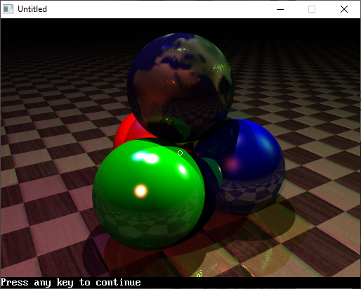

[Home](https://qb64.com) • [News](../../news.md) • [GitHub](https://github.com/QB64Official/qb64) • [Wiki](https://github.com/QB64Official/qb64/wiki) • [Samples](../../samples.md) • [InForm](../../inform.md) • [GX](../../gx.md) • [QBjs](../../qbjs.md) • [Community](../../community.md) • [More...](../../more.md)

## SAMPLE: RAY TRACER Z



### Author

[🐝 Zom-B](../zom-b.md) 

### Description

```text
This is a ray tracer I've been working on for the past 6 years. Well, on and off of course :) It's still a beta version. 43Kb. Bet this won't run in QB45.
```

### QBjs

> Please note that QBjs is still in early development and support for these examples is extremely experimental (meaning will most likely not work). With that out of the way, give it a try!

* [LOAD "ray-tracer-zomb.bas"](https://qbjs.org/index.html?src=https://qb64.com/samples/ray-tracer-z/src/ray-tracer-zomb.bas)
* [RUN "ray-tracer-zomb.bas"](https://qbjs.org/index.html?mode=auto&src=https://qb64.com/samples/ray-tracer-z/src/ray-tracer-zomb.bas)
* [PLAY "ray-tracer-zomb.bas"](https://qbjs.org/index.html?mode=play&src=https://qb64.com/samples/ray-tracer-z/src/ray-tracer-zomb.bas)

### File(s)

* [ray-tracer-zomb.bas](src/ray-tracer-zomb.bas)

🔗 [3d](../3d.md), [ray tracer](../ray-tracer.md)
