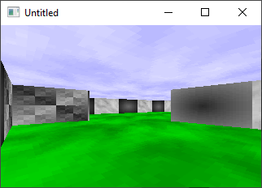

[Home](https://qb64.com) • [News](../../news.md) • [GitHub](https://github.com/QB64Official/qb64) • [Wiki](https://github.com/QB64Official/qb64/wiki) • [Samples](../../samples.md) • [InForm](../../inform.md) • [GX](../../gx.md) • [QBjs](../../qbjs.md) • [Community](../../community.md) • [More...](../../more.md)

## SAMPLE: RAYCASTER



### Author

[🐝 Antoni Gual](../antoni-gual.md) 

### Description

```text
'Antoni Gual raycaster
'Modified from Entropy's an 36-lines entry for the Biskbart's
'40-lines QB Raycaster Compo of fall-2001
'
'Added multikey handler
'Step emulation
'Added different textures, including clouds
'Separe
'with some of my ideas

'to do:
'   add screen buffer
'   optimize rendering loop
'   interpolate rays
'   shadowing
'   subpixel precision
'   make it a game???
```

### File(s)

* [rc-ent6.bas](src/rc-ent6.bas)
* [rc-ent6_orig.bas](src/rc-ent6_orig.bas)

🔗 [3d](../3d.md), [raycaster](../raycaster.md)
