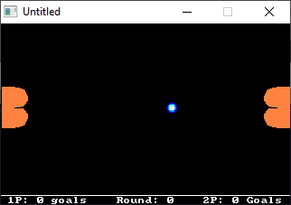

[Home](https://qb64.com) • [News](../../news.md) • [GitHub](https://github.com/QB64Official/qb64) • [Wiki](https://github.com/QB64Official/qb64/wiki) • [Samples](../../samples.md) • [InForm](../../inform.md) • [GX](../../gx.md) • [QBjs](../../qbjs.md) • [Community](../../community.md) • [More...](../../more.md)

## SAMPLE: RECTONG



### Author

[🐝 Mike Chambers](../mike-chambers.md) 

### Description

```text
Rectong v1.0 by Mike Chambers
=-=-=-=-=-=-=-=-=-=-=-=-=-=-=

Just a fun little game I wrote in QuickBasic one night.

All the control instructions can be found within the game!
You can play 1 player against computer AI, or 2 player
with a friend.

Enjoy, and please send me your feedback at: half_eaten@yahoo.com

-Mike Chambers
P.S. QuickBasic source is included.
```

### QBjs

> Please note that QBjs is still in early development and support for these examples is extremely experimental (meaning will most likely not work). With that out of the way, give it a try!

* [LOAD "rectong.bas"](https://qbjs.org/index.html?src=https://qb64.com/samples/rectong/src/rectong.bas)
* [RUN "rectong.bas"](https://qbjs.org/index.html?mode=auto&src=https://qb64.com/samples/rectong/src/rectong.bas)
* [PLAY "rectong.bas"](https://qbjs.org/index.html?mode=play&src=https://qb64.com/samples/rectong/src/rectong.bas)

### File(s)

* [rectong.bas](src/rectong.bas)
* [rectong.zip](src/rectong.zip)

🔗 [game](../game.md), [pong](../pong.md), [legacy](../legacy.md)
