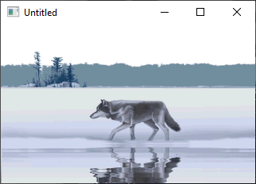

[Home](https://qb64.com) • [News](../../news.md) • [GitHub](../../github.md) • [Wiki](../../wiki.md) • [Samples](../../samples.md) • [Media](../../media.md) • [Community](../../community.md) • [Rolodex](../../rolodex.md) • [More...](../../more.md)

## SAMPLE: RIPPLES



### Author

[🐝 Antoni Gual](../antoni-gual.md) 

### Description

```text
'----------------------------------------------------------------------------
'RIPPLES, by Antoni Gual 26/1/2001   agual@eic.ictnet.es
'Simulates water reflection in a SCREEN 13 image
'----------------------------------------------------------------------------
'Who said QBasic is obsolete?
'This is a remake of the popular LAKE Java applet.
'You can experiment with different images and different values of the
'parameters passed to RIPPLES sub.
'----------------------------------------------------------------------------
'PCX Loader modified from Kurt Kuzba.
'Timber Wolf came with PaintShopPro 5, I rescaned it to fit SCREEN13
'----------------------------------------------------------------------------
'WARNING!: PCX MUST be 256 colors and 320x 200.The loader does'nt check it!!
'----------------------------------------------------------------------------
'Use as you want, only give me credit.
'E-mail me to tell me about!
'----------------------------------------------------------------------------
```

### File(s)

* [ripples.bas](src/ripples.bas)
* [ripples.zip](src/ripples.zip)
* [twolf.pcx](src/twolf.pcx)

🔗 [image processing](../image-processing.md), [ripple](../ripple.md)
