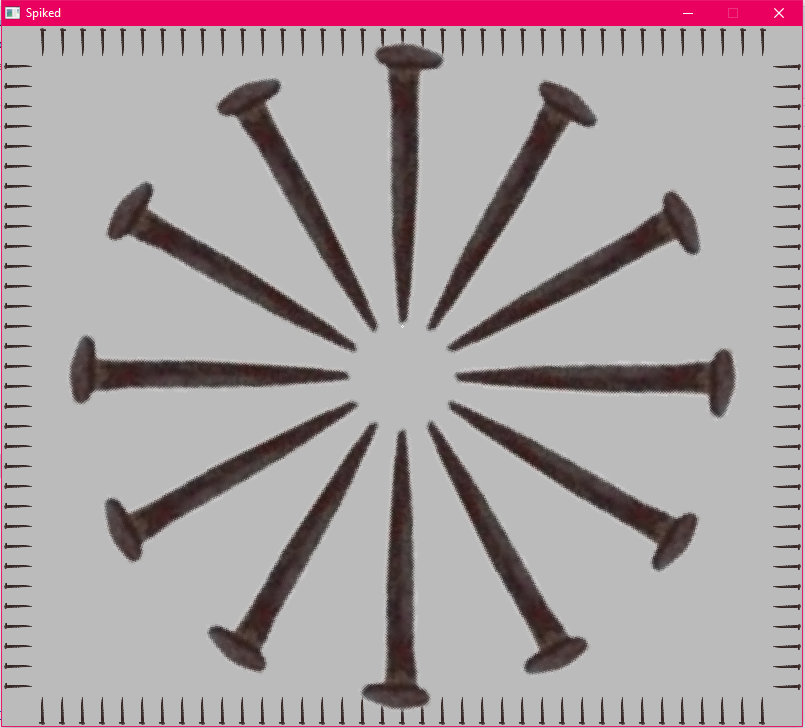
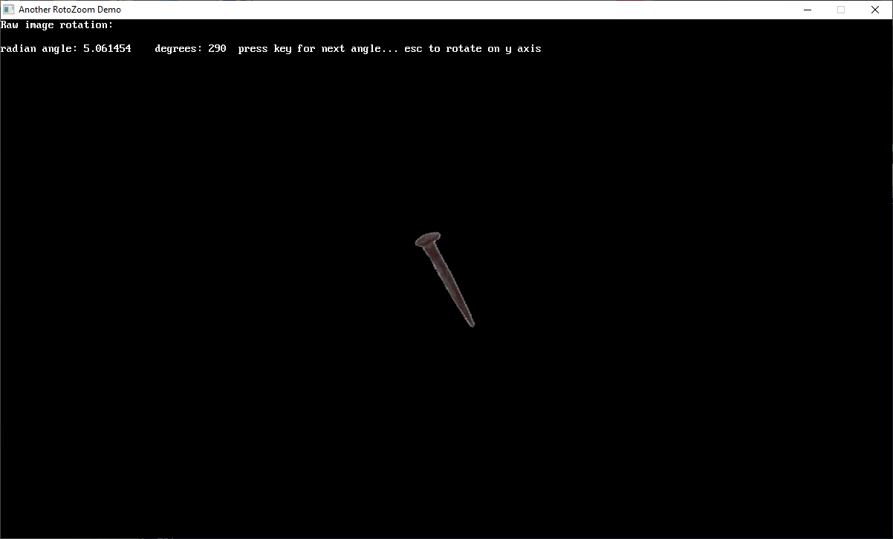
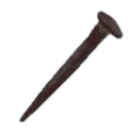

[Home](https://qb64.com) • [News](../../news.md) • [GitHub](https://github.com/QB64Official/qb64) • [Wiki](https://github.com/QB64Official/qb64/wiki) • [Samples](../../samples.md) • [InForm](../../inform.md) • [GX](../../gx.md) • [QBjs](../../qbjs.md) • [Community](../../community.md) • [More...](../../more.md)

## SAMPLE: ROTOZOOM3



### Authors

[🐝 Galleon](../galleon.md) [🐝 bplus](../bplus.md) 

### Description

```text
A modification of Galleon's RotoZoom in Wiki that both scales and rotates an image, this version scales the x-axis and y-axis independently allowing some rotations of image just by changing X or Y Scales making this already powerful routine even more a versatile image tool.
```

### File(s)

* [another-rotozoom-demo.bas](src/another-rotozoom-demo.bas)
* [another-rotozoom-demo.zip](src/another-rotozoom-demo.zip)
* [tspike.png](src/tspike.png)

### Additional Image(s)




🔗 [graphics](../graphics.md), [rotozoom](../rotozoom.md)


<sub>Reference: [qb64forum](https://qb64forum.alephc.xyz/index.php?topic=4212.0) </sub>
