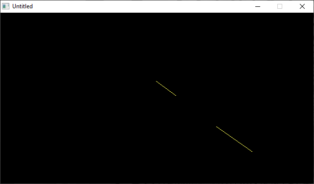

[Home](https://qb64.com) • [News](../../news.md) • [GitHub](https://github.com/QB64Official/qb64) • [Wiki](https://github.com/QB64Official/qb64/wiki) • [Samples](../../samples.md) • [InForm](../../inform.md) • [GX](../../gx.md) • [QBjs](../../qbjs.md) • [Community](../../community.md) • [More...](../../more.md)

## SAMPLE: SAVER



### Author

[🐝 David Ferrier](../david-ferrier.md) 

### Description

```text
1 '  SAVER.BAS by David Ferrier
2 '  Copyright (C) 1992 DOS Resource Guide
3 '  Published in Issue #5, page 8
4 '  This program works with both QBasic and GW-Basic

==============================================================================

-----------
 SAVER.BAS
-----------
SYSTEM REQUIREMENTS: The version of QBasic that comes with DOS 5 or later, 
Microsoft Quick Basic 4.x, or GW-Basic.

WHAT SAVER.BAS DOES:
This program is a simple screen saver.  When you run SAVER.BAS, it sends a 
bouncing yellow line dancing across your screen in a random pattern.  Use it 
when you'll be away from your computer for a period of time, but want a 
continuously changing screen display in your absence.

USING SAVER.BAS:
To run the program, type QBASIC /RUN SAVER.BAS (using path names if necessary) 
at the DOS prompt.  The bouncing yellow line will appear and move around your 
screen until you press any key to stop the program.

For further details on SAVER.BAS, see "Color Trouble" (Tips From Readers, DRG 
#5, page 8).
```

### QBjs

> Please note that QBjs is still in early development and support for these examples is extremely experimental (meaning will most likely not work). With that out of the way, give it a try!

* [LOAD "saver.bas"](https://qbjs.org/index.html?src=https://qb64.com/samples/saver/src/saver.bas)
* [RUN "saver.bas"](https://qbjs.org/index.html?mode=auto&src=https://qb64.com/samples/saver/src/saver.bas)
* [PLAY "saver.bas"](https://qbjs.org/index.html?mode=play&src=https://qb64.com/samples/saver/src/saver.bas)

### File(s)

* [saver.bas](src/saver.bas)

🔗 [screensaver](../screensaver.md), [dos world](../dos-world.md)
