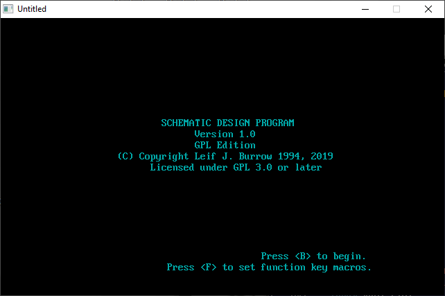

[Home](https://qb64.com) • [News](../../news.md) • [GitHub](https://github.com/QB64Official/qb64) • [Wiki](https://github.com/QB64Official/qb64/wiki) • [Samples](../../samples.md) • [InForm](../../inform.md) • [GX](../../gx.md) • [QBjs](../../qbjs.md) • [Community](../../community.md) • [More...](../../more.md)

## SAMPLE: SCHEMAT



### Author

[🐝 Leif J. Burrow](../leif-j.-burrow.md) 

### Description

```text
# Schemat
An old DOS QuickBasic schematic design editor updated for QB64.

**What is it good for?**

- Probably nothing at all.
- Maybe someone might use it to make really quick and simple schematic diagrams of small circuits for educational purposes.
- Maybe someone might place this on an old retro DOS computer for display. (If it ever works in DOS again).
- Most likely it isn't good for anything.

**Why am I doing this?**

I started this program when I was a teenager in high school. At the time I used to see ads for Circuit Maker and Electronics Workbench, two schematic capture and simulation programs that were popular at the time in electronics magazines. I did not have the money for this nor a computer capable of running them. I was still using MS-DOS.

I wanted to write a similar application myself but geared towards older PCs like my own. I thought I could do this in QuickBasic. I had not yet heard of Open Source but shareware was common then. I thought I was going to sell it for a low price and make EDA software available to everyone.

Obviously it never progressed that far but I did manage to build a simple little schematic capture program with a full version and a shareware version which my computer teacher uploaded to a BBS for me. I never heard from anyone who downloaded it.

Over the years the floppy with my code was lost or destroyed. I still had paper printouts.  I ran across these while cleaning and decided it was time to finally do something about it.  I typed it all back in using QB64 and made some modifications so that it would run.

Now I am putting it on GitHub so it doesn't get lost again. If anyone wants to extend this for their own purposes (although I doubt it) it is here. I only ask that any improvements be shared as well.

**Acknowledgements**
This program was influenced by examples from the book "Tandy Graphics and Sound for the Tandy 1000s and PC Compatables" by William Barden, Jr.

**What doesn't work**
- I am unable to test the print code as it was intended for use with old Epson compatible dot matrix printers connected to the printer port. It probably does not work in QB64 as an LPRINT width setting had to be commented out.
- The scale of some parts is a bit off. In particular the PNP symbol is much larger than the NPN symbol. I believe that this was fixed in the version which was lost. The printout was made before some of the symbols were completely finished.

**What is changed**
- The original simply saved files to and loaded files from the directory it was ran from. This made much more sense on an old computer that used floppy discs. The new version saves and loads from the current working directory when it is started. It also displays this directory in the file, save and load menus so that the user can see where it is working.
- The original used bsave and bload to save and load the schematic on the screen. This seems to work differently in QB64. Instead it now saves bitmaps as .bmp files which are more compatible with new software anyway.

**DOS**

QB64 does not target DOS. Due to changes made in the code to get it running under QB64 it probably does not build in QuickBasic anymore. I may at some point revisit this and set up some sort of build system which comments/uncomments different parts in order to allow building in QuickBasic again.
```

### QBjs

> Please note that QBjs is still in early development and support for these examples is extremely experimental (meaning will most likely not work). With that out of the way, give it a try!

* [LOAD "schemat.bas"](https://qbjs.org/index.html?src=https://qb64.com/samples/schemat/src/schemat.bas)
* [RUN "schemat.bas"](https://qbjs.org/index.html?mode=auto&src=https://qb64.com/samples/schemat/src/schemat.bas)
* [PLAY "schemat.bas"](https://qbjs.org/index.html?mode=play&src=https://qb64.com/samples/schemat/src/schemat.bas)

### File(s)

* [schemat.bas](src/schemat.bas)
* [schemat.zip](src/schemat.zip)

🔗 [circuits](../circuits.md), [schematics](../schematics.md)
