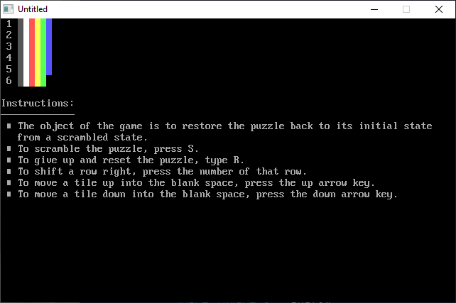

[Home](https://qb64.com) • [News](../../news.md) • [GitHub](https://github.com/QB64Official/qb64) • [Wiki](https://github.com/QB64Official/qb64/wiki) • [Samples](../../samples.md) • [InForm](../../inform.md) • [GX](../../gx.md) • [QBjs](../../qbjs.md) • [Community](../../community.md) • [More...](../../more.md)

## SAMPLE: SCRAMBLE



### Description

```text
PRINT "Instructions:"
PRINT STRING$(13, 196)
PRINT " "; CHR$(254); " The object of the game is to restore the puzzle back to its initial state"
PRINT SPACE$(3); "from a scrambled state."
PRINT " "; CHR$(254); " To scramble the puzzle, press S."
PRINT " "; CHR$(254); " To give up and reset the puzzle, type R."
PRINT " "; CHR$(254); " To shift a row right, press the number of that row."
PRINT " "; CHR$(254); " To move a tile up into the blank space, press the up arrow key."
PRINT " "; CHR$(254); " To move a tile down into the blank space, press the down arrow key."
```

### File(s)

* [scramble.bas](src/scramble.bas)
* [scramble.exe](src/scramble.exe)

🔗 [game](../game.md), [legacy](../legacy.md)
