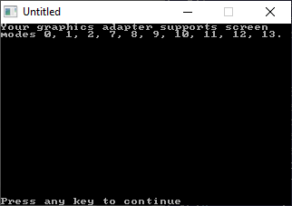

[Home](https://qb64.com) • [News](../../news.md) • [GitHub](https://github.com/QB64Official/qb64) • [Wiki](https://github.com/QB64Official/qb64/wiki) • [Samples](../../samples.md) • [InForm](../../inform.md) • [GX](../../gx.md) • [QBjs](../../qbjs.md) • [Community](../../community.md) • [More...](../../more.md)

## SAMPLE: SCREEN TESTER



### Author

[🐝 patz2009](../patz2009.md) 

### Description

```text
' PQBC Screen Tester
'-=-=-=-=-=-=-=-=-=-=-=-=-=-=-=-=-=-=-=-=-=-=-=-=-=-=-=-=-=-=-=-=-=-=-=-=-=-=
' This program looks big, but it is actually quite small. Run it through a
' decommenter to see how small it is. Anyway, this program tests what screen
' modes your graphics adapter supports. You can find one included with the
' QuickBasic 4.5 examples, but this one is easier to manipulate and more
' effective. This lists all the screen modes your computer supports, instead
' of just a few. The REMs show the variables that can be manipulated.
' This program is free to distribute as long as these first 12 lines of
' comments are NOT removed and/or changed.
' If you have questions/comments/suggestions, contact me at:
' patz2009@yahoo.com
```

### QBjs

> Please note that QBjs is still in early development and support for these examples is extremely experimental (meaning will most likely not work). With that out of the way, give it a try!

* [LOAD "screen.bas"](https://qbjs.org/index.html?src=https://qb64.com/samples/screen-tester/src/screen.bas)
* [RUN "screen.bas"](https://qbjs.org/index.html?mode=auto&src=https://qb64.com/samples/screen-tester/src/screen.bas)
* [PLAY "screen.bas"](https://qbjs.org/index.html?mode=play&src=https://qb64.com/samples/screen-tester/src/screen.bas)

### File(s)

* [screen.bas](src/screen.bas)

🔗 [graphics](../graphics.md), [utility](../utility.md), [legacy](../legacy.md)
