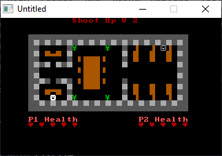
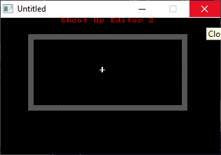

[Home](https://qb64.com) • [News](../../news.md) • [GitHub](https://github.com/QB64Official/qb64) • [Wiki](https://github.com/QB64Official/qb64/wiki) • [Samples](../../samples.md) • [InForm](../../inform.md) • [GX](../../gx.md) • [QBjs](../../qbjs.md) • [Community](../../community.md) • [More...](../../more.md)

## SAMPLE: SHOOTUP



### Author

[🐝 Nixon](../nixon.md) 

### Description

```text
Title:   Shoot Up V2
Author:  Nixon
Genre:   Arcade / 2 player
year:    2004

Game help
it's in the game.

Editor help
Use this to make your own maps.

keys

"c" = changes color
" " = puts down item
"i" = changes ASCII Character
"I" = input ASCII Character
"h" = hold
"s" = Save
"l" = Load
esc = exit without saving

I think thats all. not quite sure.
```

### File(s)

* [shoote.bas](src/shoote.bas)
* [shoote.zip](src/shoote.zip)
* [su2t.bas](src/su2t.bas)

### Additional Image(s)



🔗 [game](../game.md), [legacy](../legacy.md)
