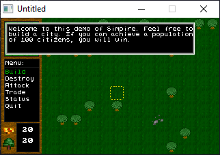

[Home](https://qb64.com) • [News](../../news.md) • [GitHub](https://github.com/QB64Official/qb64) • [Wiki](https://github.com/QB64Official/qb64/wiki) • [Samples](../../samples.md) • [InForm](../../inform.md) • [GX](../../gx.md) • [QBjs](../../qbjs.md) • [Community](../../community.md) • [More...](../../more.md)

## SAMPLE: SIMPIRE



### Author

[🐝 Pyrus](../pyrus.md) 

### Description

```text
' ²±±±±±±±±±±±±±±±±±±±±±±±±±±±±±±±±±²
' ² Simpire Beta                    ²
' ²±±±±±±±±±±±±±±±±±±±±±±±±±±±±±±±±±²
' By Pyrus, Polarris@worldnet.att.net
' E-mail me with comments or suggestions.
'
' A strategy-type game in QuickBasic.
'
' You may will out of string space or memory in Qbasic 1.1,
' but this does work in Quickbasic 4.5. I would compile it, but
' it gets alot of errors...
'
' Some of the unfinished features in the beta are that
' you cannot battle another city, you cannot load a custom
' map yet, and sound has not been added. Also, the gold mine
' needs it's options programmed. You must go down to the CHDIR
' command and change it to the directory the program is in.
' I also need to make the small map update it's self.
'
' To gain citizens, build houses and Townhalls. To gain gold,
' you cut down trees and trade them for gold or by assassinating
' another city leader. To get more soldiers, you trade gold
' for them. Use the arror keys to scroll, and S to select menu
' items.
```

### QBjs

> Please note that QBjs is still in early development and support for these examples is extremely experimental (meaning will most likely not work). With that out of the way, give it a try!

* [LOAD "ssimpire.bas"](https://qbjs.org/index.html?src=https://qb64.com/samples/simpire/src/ssimpire.bas)
* [RUN "ssimpire.bas"](https://qbjs.org/index.html?mode=auto&src=https://qb64.com/samples/simpire/src/ssimpire.bas)
* [PLAY "ssimpire.bas"](https://qbjs.org/index.html?mode=play&src=https://qb64.com/samples/simpire/src/ssimpire.bas)

### File(s)

* [ssimpire.bas](src/ssimpire.bas)
* [ssimpire.zip](src/ssimpire.zip)

🔗 [game](../game.md), [legacy](../legacy.md)
