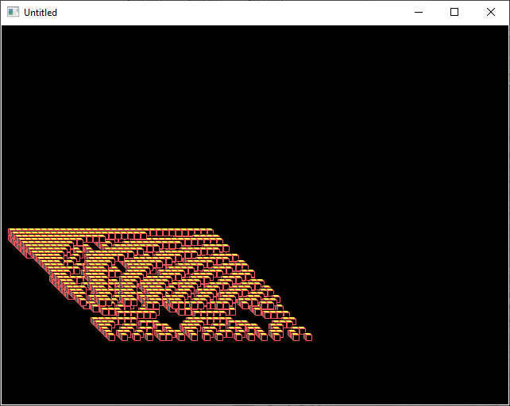

[Home](https://qb64.com) • [News](../../news.md) • [GitHub](https://github.com/QB64Official/qb64) • [Wiki](https://github.com/QB64Official/qb64/wiki) • [Samples](../../samples.md) • [InForm](../../inform.md) • [GX](../../gx.md) • [QBjs](../../qbjs.md) • [Community](../../community.md) • [More...](../../more.md)

## SAMPLE: SINECUBE



### Author

[🐝 Mennonite](../mennonite.md) 

### Description

```text
'sinecube 2006 mennonite
'public domain
```

### File(s)

* [sinecube.bas](src/sinecube.bas)
* [sinecube_orig.bas](src/sinecube_orig.bas)

🔗 [graphics](../graphics.md)
