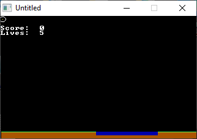

[Home](https://qb64.com) • [News](../../news.md) • [GitHub](https://github.com/QB64Official/qb64) • [Wiki](https://github.com/QB64Official/qb64/wiki) • [Samples](../../samples.md) • [InForm](../../inform.md) • [GX](../../gx.md) • [QBjs](../../qbjs.md) • [Community](../../community.md) • [More...](../../more.md)

## SAMPLE: SKYDIVER



### Author

[🐝 Jeremy Ruten](../jeremy-ruten.md) 

### Description

```text
PRINT "Welcome to Skydiver!"
PRINT "The object of the game is to"
PRINT "jump out of your airplane and"
PRINT "land in the pool. If you think"
PRINT "that you aren't going to make"
PRINT "it then you can use the arrow keys"
PRINT "when you are falling in the air."
PRINT "You must press space bar to jump."
PRINT "The pool will get smaller each time."
PRINT "You need 20 successful jumps for this"
PRINT "level."

PRINT "- Wind that pushes you while you're in the air"
PRINT "- High Scores"
PRINT "- Automatic Speed Checker"
PRINT "- Cheats and Passwords"
PRINT "- A system where you earn money and lose money"
PRINT "- Buy new and better equipment"
PRINT "- Save/Load Game (Money Version)"
PRINT "- Gravity/parachutes"
PRINT "- Better Graphics (i.e. airplane and skydiver)"
PRINT
PRINT "E-mail me for more suggestions!"
PRINT "jeremy.ruten@gmail.com"
```

### QBjs

> Please note that QBjs is still in early development and support for these examples is extremely experimental (meaning will most likely not work). With that out of the way, give it a try!

* [LOAD "skydiver.bas"](https://qbjs.org/index.html?src=https://qb64.com/samples/skydiver/src/skydiver.bas)
* [RUN "skydiver.bas"](https://qbjs.org/index.html?mode=auto&src=https://qb64.com/samples/skydiver/src/skydiver.bas)
* [PLAY "skydiver.bas"](https://qbjs.org/index.html?mode=play&src=https://qb64.com/samples/skydiver/src/skydiver.bas)

### File(s)

* [skydiver.bas](src/skydiver.bas)

🔗 [game](../game.md), [legacy](../legacy.md)
