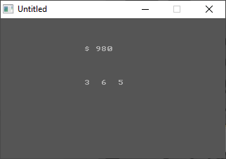

[Home](https://qb64.com) • [News](../../news.md) • [GitHub](https://github.com/QB64Official/qb64) • [Wiki](https://github.com/QB64Official/qb64/wiki) • [Samples](../../samples.md) • [InForm](../../inform.md) • [GX](../../gx.md) • [QBjs](../../qbjs.md) • [Community](../../community.md) • [More...](../../more.md)

## SAMPLE: SLOT



### Author

[🐝 Tom Sales](../tom-sales.md) 

### Description

```text
Copyright (C) 1994-95 DOS Resource Guide/DOS World 
Published in Issue #17, September 1994, page 66 and 
              Issue #20, March 1995, page 64 
 
It takes clever programming indeed to create an 
interesting one-line program. You'll be amazed at 
how much can be accomplished. 

SLOT.BAS starts you with $1000; when you press any key to enter a $10 bet,  
the slot machine's three digits spin. When the leftmost and center slots  
match, the payoff is seven times the matching number. As with "real" one- 
armed bandits, you win big when all three numbers match: 10 times the square  
of the matching number, to be exact.
```

### QBjs

> Please note that QBjs is still in early development and support for these examples is extremely experimental (meaning will most likely not work). With that out of the way, give it a try!

* [LOAD "slot.bas"](https://qbjs.org/index.html?src=https://qb64.com/samples/slot/src/slot.bas)
* [RUN "slot.bas"](https://qbjs.org/index.html?mode=auto&src=https://qb64.com/samples/slot/src/slot.bas)
* [PLAY "slot.bas"](https://qbjs.org/index.html?mode=play&src=https://qb64.com/samples/slot/src/slot.bas)

### File(s)

* [slot.bas](src/slot.bas)

🔗 [money](../money.md), [dos world](../dos-world.md), [254 chars](../254-chars.md)
