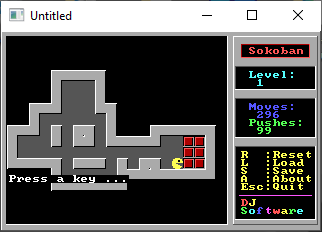

[Home](https://qb64.com) • [News](../../news.md) • [GitHub](https://github.com/QB64Official/qb64) • [Wiki](https://github.com/QB64Official/qb64/wiki) • [Samples](../../samples.md) • [InForm](../../inform.md) • [GX](../../gx.md) • [QBjs](../../qbjs.md) • [Community](../../community.md) • [More...](../../more.md)

## SAMPLE: SOKOBAN



### Author

[🐝 David Joffe](../david-joffe.md) 

### Description

```text
'/=================================================================\
'  (C) David Joffe 1997
'  DJ Software; April '97                        https://djoffe.com/
'-------------------------------------------------------------------
'  VGA Sokoban v1.0, for QBasic!
'-------------------------------------------------------------------
```

### File(s)

* [djsok.bas](src/djsok.bas)
* [djsok.dat](src/djsok.dat)
* [sokoban.zip](src/sokoban.zip)

🔗 [game](../game.md), [puzzle](../puzzle.md)


<sub>Reference: [djoffe.com](https://djoffe.com/) </sub>
