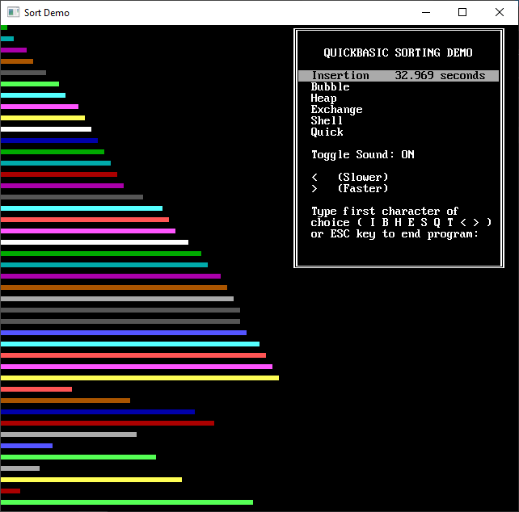

[Home](https://qb64.com) • [News](../../news.md) • [GitHub](https://github.com/QB64Official/qb64) • [Wiki](https://github.com/QB64Official/qb64/wiki) • [Samples](../../samples.md) • [InForm](../../inform.md) • [GX](../../gx.md) • [QBjs](../../qbjs.md) • [Community](../../community.md) • [More...](../../more.md)

## SAMPLE: SORT DEMO



### Author

[🐝 Microsoft](../microsoft.md) 

### Description

```text
'                                 SORTDEMO
' This program graphically demonstrates six common sorting algorithms.  It
' prints 25 or 43 horizontal bars, all of different lengths and all in random
' order, then sorts the bars from smallest to longest.
'
' The program also uses SOUND statements to generate different pitches,
' depending on the location of the bar being printed. Note that the SOUND
' statements delay the speed of each sorting algorithm so you can follow
' the progress of the sort.  Therefore, the times shown are for comparison
' only. They are not an accurate measure of sort speed.
'
' If you use these sorting routines in your own programs, you may notice
' a difference in their relative speeds (for example, the exchange
' sort may be faster than the shell sort) depending on the number of
' elements to be sorted and how "scrambled" they are to begin with.
```

### QBjs

> Please note that QBjs is still in early development and support for these examples is extremely experimental (meaning will most likely not work). With that out of the way, give it a try!

* [LOAD "sortdemo.bas"](https://qbjs.org/index.html?src=https://qb64.com/samples/sort-demo/src/sortdemo.bas)
* [RUN "sortdemo.bas"](https://qbjs.org/index.html?mode=auto&src=https://qb64.com/samples/sort-demo/src/sortdemo.bas)
* [PLAY "sortdemo.bas"](https://qbjs.org/index.html?mode=play&src=https://qb64.com/samples/sort-demo/src/sortdemo.bas)

### File(s)

* [sortdemo.bas](src/sortdemo.bas)

🔗 [sort](../sort.md)
