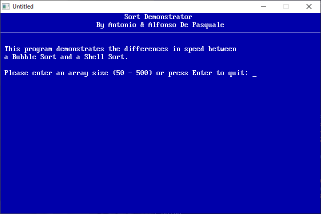

[Home](https://qb64.com) • [News](../../news.md) • [GitHub](https://github.com/QB64Official/qb64) • [Wiki](https://github.com/QB64Official/qb64/wiki) • [Samples](../../samples.md) • [InForm](../../inform.md) • [GX](../../gx.md) • [QBjs](../../qbjs.md) • [Community](../../community.md) • [More...](../../more.md)

## SAMPLE: SORT



### Author

[🐝 A&A De Pasquale](../a&a-de-pasquale.md) 

### Description

```text
' SORT.BAS
'   by Antonio and Alfonso De Pasquale
' Copyright (C) 1994 DOS Resource Guide
' Published in Issue #17, September 1994, page 64

***************************************************************************** 
 
 SORT.BAS 
   by Antonio and Alfonso De Pasquale 
 Copyright (C) 1994 DOS Resource Guide 
 Published in Issue #17, September 1994, page 64 
 
If you're in the habit of using QBasic arrays to store phone lists, personnel  
information, sales figures, and the like, it's a sure bet that someday you'll  
want to rearrange your data. 
 
Maybe you'll need to list contacts by area code, or perhaps you'll want to  
rank employees according to salary. Whatever the reason, you probably won't  
want to spend hours to write and debug a sort routine. But if you add the two  
subprograms BUBBLESORT and SHELLSORT contained in the program SORT.BAS to  
your library of reusable code, lack of time won't pose a problem. 
 
You can decide whether your situation calls for a bubble sort or a shell  
sort, merge the appropriate subprogram with your existing QBasic program, add  
a few lines of code, and get right down to the business of sorting your  
arrays. 
 
To run the program from the DOS command line and see a demonstration of the  
sorting routines, change to the directory containing SORT.BAS, then type: 
 
QBASIC /RUN SORT 
 
 
What Are Arrays? 
---------------- 
Arrays are tools for storing, organizing, and processing data efficiently in  
a computer's memory. They're particularly handy for holding data items of the  
same type and purpose. 
 
For example, a calendar program might use arrays to hold the names of the  
days of the week, the number of days in each month, and so on. From a  
programming standpoint, it makes more sense to store the days of the week in  
a single array than to declare a different variable for each day of the week.  
Creating an array involves less coding and uses the computer's memory more  
efficiently. 
 
QBasic uses a DIM (for dimension) statement to declare arrays. The basic  
syntax is the key word, DIM, followed by a parenthetical phrase that provides  
the array's name and size. The following commands, for instance, declare two  
arrays: a string array consisting of seven elements and a numeric array  
consisting of 31 elements: 
 
DIM DAY$(7) 
DIM MONTHS(31) 
 
QBasic lets you declare either numeric or string arrays. As the following  
example shows, you may also use variables instead of numbers when declaring  
the size of an array: 
 
ARSIZE=250 
DIM TOTAL(ARSIZE) 
 
The first line sets the variable ARSIZE to 250; the second sets, or  
dimensions, the array to the size specified by ARSIZE. 
 
Bubble or Shell? 
---------------- 
The simplest method of arranging the elements of a QBasic array is a bubble  
sort. The procedure involves looking at adjacent elements in the array and  
swapping their values when the elements are out of order. When you're sorting  
values in ascending order, swapping values moves the largest values down the  
array, permitting the smallest values to "bubble" to the top. 
 
To sort data properly, the algorithm for a bubble sort must make several  
passes through an array. The exact number of passes required is the total  
number of elements in the array minus one. If your array contains 500 data  
items, for instance, a bubble sort requires 499 passes to sort it properly. 
 
As you might expect, a bubble sort is best suited for smaller arrays. The  
algorithm, although easy to understand, is inefficient when working with  
large arrays, because each element moves up or down by only one position in  
each pass. 
 
Named after its creator, Donald Shell, a shell sort provides a more efficient  
method of processing larger arrays. Whereas a bubble sort compares and swaps  
adjacent elements, the shell sort compares and swaps non-adjacent elements.  
It begins by comparing the first element of the array with the middle  
element, referred to as the gap. If no swap is made, the gap is halved and  
non-adjacent elements are compared again. The gap is compared and halved  
repeatedly until a swap is made. 
 
Because this algorithm requires fewer comparisons in each pass through the  
array, a shell sort arranges data more quickly than a bubble sort.  
Consequently, a shell sort is superior to a bubble sort in most  
circumstances. The bubble sort's only real advantages are that the routine is  
compact and its logic is easy to follow. When working with moderate to large  
arrays, the shell sort should be your routine of choice. 
 
The SORT.BAS Program 
-------------------- 
SORT.BAS shows how you might write subprograms to perform these two types of  
sorts. The first part of the program prompts you for an array size, generates  
an array of random numbers, and asks whether you want to perform a bubble or  
a shell sort. The program then displays the starting and ending times of the  
sort and displays the results on screen. This part of the listing is included  
strictly for illustrative purposes. The meat of the listing is the pair of  
subprograms, BUBBLESORT and SHELLSORT. 
 
Using the Program 
----------------- 
To run the program if it is already loaded into QBasic, select Start from the  
Run menu or press Shift-F5. You also may run the program from DOS by changing  
to the directory containing SORT.BAS, and typing 
 
QBASIC /RUN SORT 
 
 
The screen will clear, and a greeting will appear. The program will then ask  
you to specify the size of the array to be used for demonstrating the sort  
routines, restricting the size to the range of 50 to 500 elements.  Then the  
program will take a few moments to create an array of randomly selected  
numbers. 
 
When the menu appears, you have three choices: pressing B to perform a bubble  
sort, S to perform a shell sort, or Q to quit the program. When you press B  
or S, the program displays the starting time and begins the sort. When  
sorting is complete, the program displays the ending time. Press Enter to  
view the sorted numbers on screen. As we mentioned earlier, a bubble sort is  
best suited for small arrays; a shell sort dramatically improves performance  
with larger arrays. When you specify large array sizes, you'll see the  
dramatic advantage of the shell sort. 
 
Creating a Sort Library 
----------------------- 
To use the two sorting subprograms in your own programs, you must first  
isolate them from the original program and then add them to your code. Start  
by using your mouse or the Shift keys in conjunction with the arrow keys to  
highlight the sections of SORT.BAS that you don't need and delete them. Then,  
use the File menu's Save As option to save the subprograms under a different  
name, perhaps SORT.LIB. (You may save each subprogram separately, of course.) 
 
Unfortunately, QBasic doesn't provide an import feature for merging  
subprograms into a loaded program. You may use a DOS copy command such as the  
following, however, to append the subprograms to your own QBasic code: 
 
copy filename + sort.lib 
 
Just substitute the name of your QBasic program for filename. This command  
attaches the two subprograms to the bottom of your QBasic program. The next  
time you call up QBasic and load your program, the proper declare statements  
will automatically be added to your code, and the subprograms BUBBLESORT and  
SHELLSORT will appear in the QBasic Subs list. 
 
Of course, you may also simply type in the BUBBLESORT and SHELLSORT code into  
your programs as needed.  The above procedure saves you the effort of typing. 
 
Calling the Functions 
--------------------- 
Whether you want to perform a bubble sort or a shell sort, you must pass the  
name of the array to be sorted to the subprogram. The following QBasic code  
illustrates the proper syntax for calling the subprograms: 
 
BUBBLESORT ARRAY1() 
SHELLSORT  ARRAY2() 
 
In the first line, ARRAY1() is the name of the array; notice that you must  
include the parentheses to inform QBasic that this variable refers to an  
array. The subprogram then takes over and sorts the data in the stated array.  
In the second line, ARRAY2() is the name of the array. In your own programs,  
you may substitute any valid numeric array name for ARRAY1() and ARRAY2(). 
 
Further Modifications 
--------------------- 
As written, the two sort subprograms are designed to arrange numeric data,  
but you may modify them to work with string data (alphabetic characters), as  
well. To do this, simply add a dollar sign ($) to the array name when  
defining, declaring, or calling the subprograms. The dollar sign informs  
QBasic that you're working with a string array rather than a numeric array.  
Your declare statements, for example, would look like this: 
 
DECLARE SUB BUBBLESORT (ARRAY$()) 
DECLARE SUB SHELLSORT (ARRAY$())  
 
The first lines of the functions themselves would look like this: 
 
SUB BUBBLESORT (ARRAY$()) 
. 
.}more work done in these lines 
. 
 
SUB SHELLSORT (ARRAY$()) 
. 
.}more work done in these lines 
. 
 
The code to call these routines would look like this: 
BUBBLESORT ARRAY1$() 
SHELLSORT  ARRAY2$() 
 
Those are the basics of working with arrays. Even if your QBasic programs  
don't require sort routines right now, you might want to spend a little time  
experimenting to make sure you grasp the fundamental rules. Then just tuck  
the subprograms into your QBasic library for future reference.
```

### QBjs

> Please note that QBjs is still in early development and support for these examples is extremely experimental (meaning will most likely not work). With that out of the way, give it a try!

* [LOAD "sort.bas"](https://qbjs.org/index.html?src=https://qb64.com/samples/sort/src/sort.bas)
* [RUN "sort.bas"](https://qbjs.org/index.html?mode=auto&src=https://qb64.com/samples/sort/src/sort.bas)
* [PLAY "sort.bas"](https://qbjs.org/index.html?mode=play&src=https://qb64.com/samples/sort/src/sort.bas)

### File(s)

* [sort.bas](src/sort.bas)

🔗 [sort](../sort.md), [dos world](../dos-world.md)
