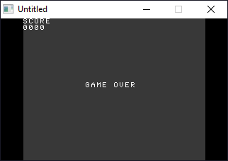
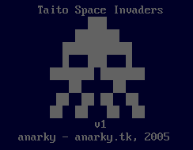

[Home](https://qb64.com) • [News](../../news.md) • [GitHub](https://github.com/QB64Official/qb64) • [Wiki](https://github.com/QB64Official/qb64/wiki) • [Samples](../../samples.md) • [InForm](../../inform.md) • [GX](../../gx.md) • [QBjs](../../qbjs.md) • [Community](../../community.md) • [More...](../../more.md)

## SAMPLE: SPACE INVADERS



### Author

[🐝 anarky](../anarky.md) 

### Description

```text
Taito's Space Invaders


    ##     The Invaders march ...
   ####      Bom bom bom bom ...
  ######       Left, right, fire!
 ## ## ##        Faster, faster they march ...
 ########          Suddenly you're 11 again!
   #  #              Dodge the bombs ...
  # ## #               They're turning green ...
 # #  # #                Get them before they land!


A version of Taito's original Space Invaders(TM) for the PC

anarky, April 2005

http://www.anarky.tk/
anarkynet@hotmail.com

Disclaimer

This game is mailware. That is, it's free to use and distribute anywhere you
like, but only on condition that you keep the two files together and that you
don't charge any payment for it. Also, when you download it, email me on the
above address.

Also, I cannot be held responsible if this program does anything nasty to your
machine. It hasn't damaged anyone's PC that I'm aware of and there's no reason
why it should, really.
```

### QBjs

> Please note that QBjs is still in early development and support for these examples is extremely experimental (meaning will most likely not work). With that out of the way, give it a try!

* [LOAD "invader.bas"](https://qbjs.org/index.html?src=https://qb64.com/samples/space-invaders/src/invader.bas)
* [RUN "invader.bas"](https://qbjs.org/index.html?mode=auto&src=https://qb64.com/samples/space-invaders/src/invader.bas)
* [PLAY "invader.bas"](https://qbjs.org/index.html?mode=play&src=https://qb64.com/samples/space-invaders/src/invader.bas)

### File(s)

* [invader.bas](src/invader.bas)
* [invader.zip](src/invader.zip)

### Additional Image(s)



🔗 [game](../game.md), [space invaders](../space-invaders.md), [legacy](../legacy.md)
