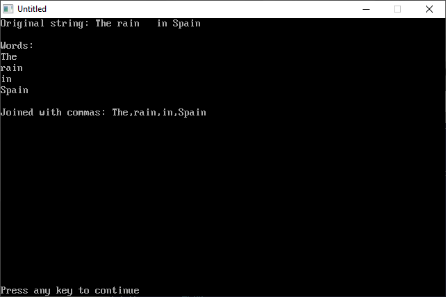

[Home](https://qb64.com) • [News](../../news.md) • [GitHub](https://github.com/QB64Official/qb64) • [Wiki](https://github.com/QB64Official/qb64/wiki) • [Samples](../../samples.md) • [InForm](../../inform.md) • [GX](../../gx.md) • [QBjs](../../qbjs.md) • [Community](../../community.md) • [More...](../../more.md)

## SAMPLE: SPLITJOIN



### Author

[🐝 luke](../luke.md) 

### Description

```text
Given a string of words separated by spaces (or any other character), splits it into an array of the words. I've no doubt many people have written a version of this over the years and no doubt there's a million ways to do it, but I thought I'd put mine here so we have at least one version. There's also a join function that does the opposite array -> single string.

Code is hopefully reasonably self explanatory with comments and a little demo. Note, this is akin to Python/JavaScript split/join, PHP explode/implode.
```

### QBjs

> Please note that QBjs is still in early development and support for these examples is extremely experimental (meaning will most likely not work). With that out of the way, give it a try!

* [LOAD "splitjoin.bas"](https://qbjs.org/index.html?src=https://qb64.com/samples/splitjoin/src/splitjoin.bas)
* [RUN "splitjoin.bas"](https://qbjs.org/index.html?mode=auto&src=https://qb64.com/samples/splitjoin/src/splitjoin.bas)
* [PLAY "splitjoin.bas"](https://qbjs.org/index.html?mode=play&src=https://qb64.com/samples/splitjoin/src/splitjoin.bas)

### File(s)

* [splitjoin.bas](src/splitjoin.bas)

🔗 [data management](../data-management.md), [split](../split.md)


<sub>Reference: [qb64forum](https://qb64forum.alephc.xyz/index.php?topic=1073.0) </sub>
