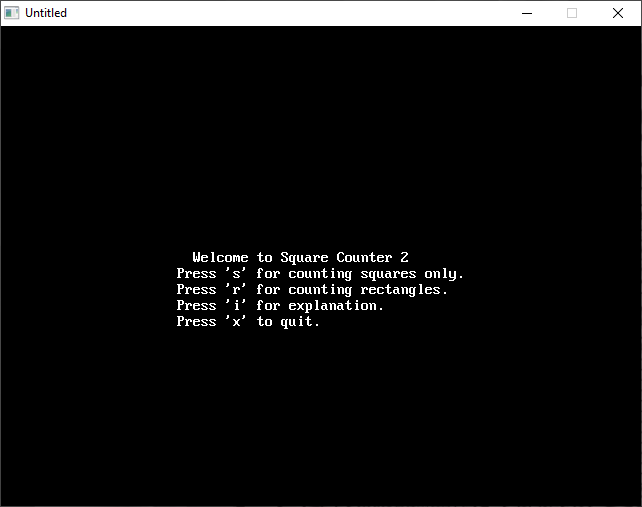

[Home](https://qb64.com) • [News](../../news.md) • [GitHub](https://github.com/QB64Official/qb64) • [Wiki](https://github.com/QB64Official/qb64/wiki) • [Samples](../../samples.md) • [InForm](../../inform.md) • [GX](../../gx.md) • [QBjs](../../qbjs.md) • [Community](../../community.md) • [More...](../../more.md)

## SAMPLE: SQUARE COUNTER



### Author

[🐝 Paulunknown](../paulunknown.md) 

### Description

```text
PRINT "    This is a program used to count squares or rectangles for"
PRINT " people who don't want to waste their time on solving annoying"
PRINT " long puzzles where they need to count how many squares or rectangles"
PRINT " are in a certain grid. NOTE: A 3 by 3 grid don't just have 9, it also"
PRINT " count the bigger ones (like the grid itself). So a 3 by 3 have 14"
PRINT " squares in total."
```

### QBjs

> Please note that QBjs is still in early development and support for these examples is extremely experimental (meaning will most likely not work). With that out of the way, give it a try!

* [LOAD "rect2.bas"](https://qbjs.org/index.html?src=https://qb64.com/samples/square-counter/src/rect2.bas)
* [RUN "rect2.bas"](https://qbjs.org/index.html?mode=auto&src=https://qb64.com/samples/square-counter/src/rect2.bas)
* [PLAY "rect2.bas"](https://qbjs.org/index.html?mode=play&src=https://qb64.com/samples/square-counter/src/rect2.bas)

### File(s)

* [rect2.bas](src/rect2.bas)

🔗 [legacy](../legacy.md)
