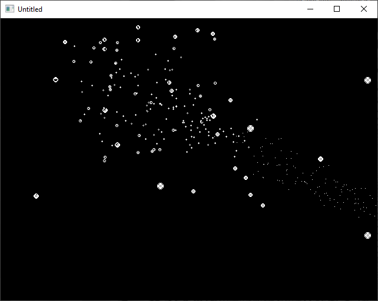

[Home](https://qb64.com) • [News](../../news.md) • [GitHub](https://github.com/QB64Official/qb64) • [Wiki](https://github.com/QB64Official/qb64/wiki) • [Samples](../../samples.md) • [InForm](../../inform.md) • [GX](../../gx.md) • [QBjs](../../qbjs.md) • [Community](../../community.md) • [More...](../../more.md)

## SAMPLE: STARFIELD TORUS



### Author

[🐝 JKC](../jkc.md) 

### Description

```text
'This is my starfield entry hacked down to 25 lines
'It needs a pretty fast computer...looks OK on my 1.5 GHz
'JKC 2003
```

### QBjs

> Please note that QBjs is still in early development and support for these examples is extremely experimental (meaning will most likely not work). With that out of the way, give it a try!

* [LOAD "starfild.bas"](https://qbjs.org/index.html?src=https://qb64.com/samples/starfield-torus/src/starfild.bas)
* [RUN "starfild.bas"](https://qbjs.org/index.html?mode=auto&src=https://qb64.com/samples/starfield-torus/src/starfild.bas)
* [PLAY "starfild.bas"](https://qbjs.org/index.html?mode=play&src=https://qb64.com/samples/starfield-torus/src/starfild.bas)

### File(s)

* [starfild.bas](src/starfild.bas)

🔗 [starfield](../starfield.md)
