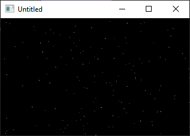

[Home](https://qb64.com) • [News](../../news.md) • [GitHub](../../github.md) • [Wiki](../../wiki.md) • [Samples](../../samples.md) • [Media](../../media.md) • [Community](../../community.md) • [Rolodex](../../rolodex.md) • [More...](../../more.md)

## SAMPLE: STARFIELD 9 LINE



### Author

[🐝 Antoni Gual](../antoni-gual.md) 

### Description

```text
'Starfield by Antoni gual
'for Rel's 9 LINER contest at QBASICNEWS.COM  1/2003
'------------------------------------------------------------------------
```

### Code

#### strfld.bas

```vb

'Starfield by Antoni gual
'for Rel's 9 LINER contest at QBASICNEWS.COM  1/2003
'------------------------------------------------------------------------

$NoPrefix
DefLng A-Z
Option Explicit
Option ExplicitArray

$Resize:Smooth
Screen 13
FullScreen SquarePixels , Smooth

Dim a As String
Dim As Single j

a = String$(400 * 6, Chr$(0))

Do
    3 If CVI(Mid$(a, j + 5, 2)) = 0 Then Mid$(a, j + 1, 6) = MKI$(Rnd * 20000 - 10000) + MKI$(Rnd * 20000 - 10000) + MKI$(100 * Rnd + 1)
    PSet (160 + CVI(Mid$(a, j + 1, 2)) / CVI(Mid$(a, j + 5, 2)), 100 + CVI(Mid$(a, j + 3, 2)) / CVI(Mid$(a, j + 5, 2))), 0
    Mid$(a, j + 5, 2) = MKI$(CVI(Mid$(a, j + 5, 2)) - 1)
    If CVI(Mid$(a, j + 5, 2)) > 0 Then PSet (160 + CVI(Mid$(a, j + 1, 2)) / CVI(Mid$(a, j + 5, 2)), 100 + CVI(Mid$(a, j + 3, 2)) / CVI(Mid$(a, j + 5, 2))), 32 - CVI(Mid$(a, j + 5, 2)) \ 8
    j = (j + 6) Mod (Len(a))
    Delay .0001
Loop While Len(InKey$) = 0

System 0

```

### File(s)

* [strfld.bas](src/strfld.bas)

🔗 [starfield](../starfield.md), [9 lines](../9-lines.md)
