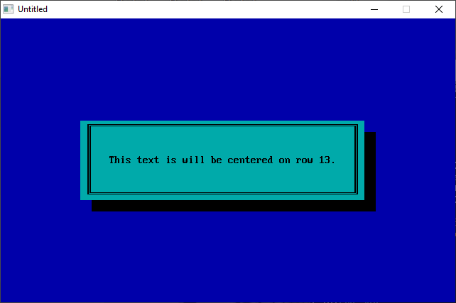

[Home](https://qb64.com) • [News](../../news.md) • [GitHub](https://github.com/QB64Official/qb64) • [Wiki](https://github.com/QB64Official/qb64/wiki) • [Samples](../../samples.md) • [InForm](../../inform.md) • [GX](../../gx.md) • [QBjs](../../qbjs.md) • [Community](../../community.md) • [More...](../../more.md)

## SAMPLE: TEMPLATE DW



### Author

[🐝 Tim Syrop](../tim-syrop.md) 

### Description

```text
' TEMPLATE.BAS
'   by Tim Syrop
' Copyright (C) 1994 DOS World
' Published in Issue #18, November 1994, page 62

***************************************************************************** 
 
 TEMPLATE.BAS 
   by Tim Syrop 
 Copyright (C) 1994 DOS World 
 Published in Issue #18, November 1994, page 62 
 
Well-constructed programs should include attractive screen displays and a  
good user interface. The trouble is, writing procedures to handle these tasks  
often forces you to focus your attention on ancillary matters rather than on  
the main program. To avoid spending precious programming time on secondary  
code, you may want to incorporate the subprograms included in the  
TEMPLATE.BAS program.  TEMPLATE.BAS contains four useful subprograms: a  
routine for drawing a box, one for temporarily pausing a program, another for  
sounding a beep, and a fourth for displaying text in the center of a row. 
 
To run the program from the DOS command line and see the subprograms in  
action, change to the directory containing TEMPLATE.BAS, then type: 
 
QBASIC /RUN TEMPLATE 
 
 
The subprogram DRAWBOX colors the screen and places a shaded text box of any  
size or color anywhere on the display. You may change the size, location, and  
color of screen elements at any point in your program, by calling DRAWBOX and  
varying the values of its parameters. PAUSE suspends program execution for  
the requested period of time. BEEPER lets you alert the user to an event-- 
perhaps to indicate that he or she pressed an incorrect key, for example.  
CENTEXT lets you center a message on any row on screen. 
 
To insert one of the subprograms into a program that needs that particular  
feature, you can type the subprogram code into your program or use QBasic's  
editor to copy the subprogram code and paste it into your program. At the  
appropriate point in your program, add a command to "activate" the  
subprogram. The four statements at the end of TEMPLATE.BAS's main routine  
show the correct syntax for calling each subprogram. 
 
DRAWBOX requires that you supply seven parameters. LR% indicates the row of  
the upper-left corner of the box, and LC% represents its column location; RR%  
indicates the row location of the lower-right corner of the box, and RC% is  
its column location. SC% controls the overall screen color; FC% controls the  
foreground color of the text box; and BC% controls the color of the text box. 
 
For example, the sequence DRAWBOX 10, 15, 16, 65, 1, 0, 11 draws a cyan box,  
on a blue screen, positioning the upper-left corner at location 10, 15 and  
the lower-right corner at location 16, 65. The border of the box and the  
shading around it are black. If you use an unacceptable location or color,  
you receive an error message. See the COLOR VALUES table under the  
instructions for FUNSUBS.BAS for a list of numbers used to specify colors. 
 
PAUSE includes only one parameter: the amount of time, in seconds, for which  
you want to suspend your program. You may use decimal values, such as 12.25.  
Suppose, for instance, that you want the user to read a message for 60  
seconds. Inserting the command PAUSE 60 into the program accomplishes this.  
(The lines containing the variable TRASH$ eliminate any keystrokes the user  
may enter while waiting for execution to resume.) 
 
BEEPER replaces QBasic's BEEP statement and produces a less irritating tone.  
It has no parameters. To modify the sound, try experimenting with the  
subprogram's play statement. (QBasic's on-line help provides details.) 
 
CENTEXT has two parameters: ROW% and TEXT$. The former indicates the row on  
which you want to display your text; the latter is the text you want in that  
row. If you issue the command CENTEXT 13, "This text will be centered in row  
13.", for example, the text in quotes is centered within the screen's 13th  
row. 
 
You'll save a great deal of time with the subprograms in TEMPLATE.BAS.  
Whenever you need one of these routines, you won't have to write it again and  
again--it's right at your fingertips.
```

### QBjs

> Please note that QBjs is still in early development and support for these examples is extremely experimental (meaning will most likely not work). With that out of the way, give it a try!

* [LOAD "template.bas"](https://qbjs.org/index.html?src=https://qb64.com/samples/template-dw/src/template.bas)
* [RUN "template.bas"](https://qbjs.org/index.html?mode=auto&src=https://qb64.com/samples/template-dw/src/template.bas)
* [PLAY "template.bas"](https://qbjs.org/index.html?mode=play&src=https://qb64.com/samples/template-dw/src/template.bas)

### File(s)

* [template.bas](src/template.bas)

🔗 [tui](../tui.md), [dos world](../dos-world.md)
