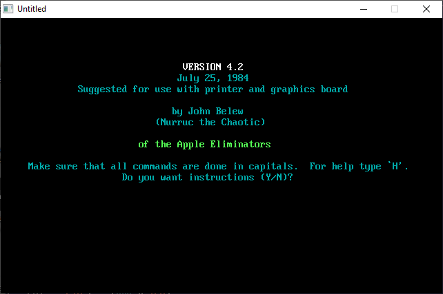

[Home](https://qb64.com) • [News](../../news.md) • [GitHub](https://github.com/QB64Official/qb64) • [Wiki](https://github.com/QB64Official/qb64/wiki) • [Samples](../../samples.md) • [InForm](../../inform.md) • [GX](../../gx.md) • [QBjs](../../qbjs.md) • [Community](../../community.md) • [More...](../../more.md)

## SAMPLE: TEMPLE



### Author

[🐝 John Belew](../john-belew.md) 

### Description

```text
710 REM    ****************************************************
720 REM    *  WRITTEN BY JOHN BELEW FOR USE WITH THE I.B.M.   *
730 REM    *            AND OTHER COMPATIBLE                  *
740 REM    *        THANKS TO TSR FOR THE MONSTERS            *
750 REM    * THANKS TO RECREATIONAL COMPUTING FOR THE ORIGINAL*
760 REM    * PROGRAM          JUNE 29, 1984                   *
770 REM    ****************************************************
```

### QBjs

> Please note that QBjs is still in early development and support for these examples is extremely experimental (meaning will most likely not work). With that out of the way, give it a try!

* [LOAD "temple.bas"](https://qbjs.org/index.html?src=https://qb64.com/samples/temple/src/temple.bas)
* [RUN "temple.bas"](https://qbjs.org/index.html?mode=auto&src=https://qb64.com/samples/temple/src/temple.bas)
* [PLAY "temple.bas"](https://qbjs.org/index.html?mode=play&src=https://qb64.com/samples/temple/src/temple.bas)

### File(s)

* [temple.bas](src/temple.bas)

🔗 [game](../game.md), [legacy](../legacy.md)
