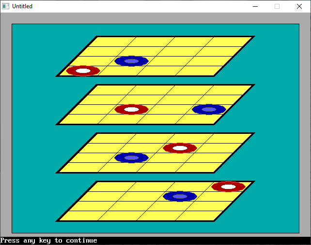

[Home](https://qb64.com) • [News](../../news.md) • [GitHub](https://github.com/QB64Official/qb64) • [Wiki](https://github.com/QB64Official/qb64/wiki) • [Samples](../../samples.md) • [InForm](../../inform.md) • [GX](../../gx.md) • [QBjs](../../qbjs.md) • [Community](../../community.md) • [More...](../../more.md)

## SAMPLE: TIC TAC TOE 3D



### Author

[🐝 qbguy](../qbguy.md) 

### Description

```text
The goal is to get four in a row while preventing the computer from doing the same. Move by clicking the mouse.
```

### QBjs

> Please note that QBjs is still in early development and support for these examples is extremely experimental (meaning will most likely not work). With that out of the way, give it a try!

* [LOAD "tictactoe3d.bas"](https://qbjs.org/index.html?src=https://qb64.com/samples/tic-tac-toe-3d/src/tictactoe3d.bas)
* [RUN "tictactoe3d.bas"](https://qbjs.org/index.html?mode=auto&src=https://qb64.com/samples/tic-tac-toe-3d/src/tictactoe3d.bas)
* [PLAY "tictactoe3d.bas"](https://qbjs.org/index.html?mode=play&src=https://qb64.com/samples/tic-tac-toe-3d/src/tictactoe3d.bas)

### File(s)

* [tictactoe3d.bas](src/tictactoe3d.bas)

🔗 [game](../game.md), [tic tac toe](../tic-tac-toe.md)
