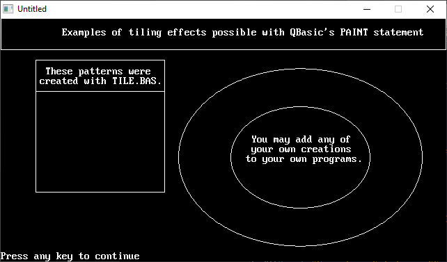

[Home](https://qb64.com) • [News](../../news.md) • [GitHub](https://github.com/QB64Official/qb64) • [Wiki](https://github.com/QB64Official/qb64/wiki) • [Samples](../../samples.md) • [InForm](../../inform.md) • [GX](../../gx.md) • [QBjs](../../qbjs.md) • [Community](../../community.md) • [More...](../../more.md)

## SAMPLE: TILE DEMO



### Author

[🐝 Greg Ennen](../greg-ennen.md) 

### Description

```text
' TILEDEMO.BAS
'   by Greg Ennen
' Copyright (C) 1995 DOS World
' Published in Issue #21, May 1995, page 57

***************************************************************************** 
 
 TILE.BAS 
 TILEDEMO.BAS 
   by Greg Ennen 
 Copyright (C) 1995 DOS World 
 Published in Issue #21, May 1995, page 57 
 
When your thoughts turn to redecoration, one of the first options you  
probably consider is wallpaper.  TILE.BAS is a program that helps you create  
computerized wallpaper that you can incorporate into your QBasic programs to  
provide an interesting background pattern to otherwise boring screen  
displays. 
 
TILE.BAS assists you in developing repeating pattern blocks, or "tiles," then  
converting the tile into program code (a "tile string") that QBasic programs  
can understand and use.  TILEDEMO.BAS demonstrates how to use the tile  
strings in a program. 
 
To run the TILE.BAS from the DOS command line, change to the directory  
containing TILE.BAS, then type: 
 
QBASIC /RUN TILE 
 
 
To run the TILEDEMO.BAS from the DOS command line, change to the directory  
containing TILEDEMO.BAS, then type: 
 
QBASIC /RUN TILEDEMO 
 
 
When you run TILE.BAS, you fill in a design grid pixel by pixel, using any of  
the 16 colors available from QBasic's screen 9, then press a key to view the  
wallpaper effect your design will produce.  If you like what you see, you can  
save the tile string in a file. 
 
From there, it's a simple matter of copying the file containing the tile  
string into your own program and painting it into an object.  TILEDEMO.BAS  
shows how you might incorporate several tile strings created with TILE.BAS  
into a single screen. 
 
TILE.BAS's program screen contains four main elements: a tile-design window,  
where you create your pattern; a color bar, which indicates your color  
options; a tile-display window, which shows how your pattern will look when  
tiled; and a command and message area. 
 
When you start the program, the cursor is in the upper-left corner of the  
tile-design grid, so that you can begin designing a pattern block  
immediately.  To move the cursor left, right, up, or down, press the arrow  
keys; to move diagonally, use Home, Page Up, End, or Page Down.  To mark a  
square with a particular color, position the cursor, then press the number or  
letter corresponding to the color you want.  For instance, to color a square  
white, press F. 
 
When you are ready to see what sort of wallpaper effect your tile produces  
when repeated, press the T key.  The screen's message line displays the tile  
string used to create that effect. (If the string is long, only its final  
characters are visible.) 
 
When you edit the tile pattern and press the T key to update the tile-display  
window, the tile string changes.  To clear the existing pattern, press the N  
key to display a new grid.  By default, the design grid is 8 pixels by 8  
pixels.  To choose an 8-by-12-pixel grid or an 8-by-16-pixel grid, press the  
G key. 
 
When you're satisfied with your tile, save it to disk by pressing the S key.   
The program prompts you for a path and filename.  For instance, to save a  
file called FRET and store it in a directory called C:\QBASIC\TILE, type this  
line: 
 
  C:\QBASIC\TILE\FRET 
 
Laying Tiles 
------------ 
After creating a few tile strings, you're ready to begin filling objects with  
them.  To understand the process, take a look at TILEDEMO.BAS.  It start by  
clearing the screen and issuing a SCREEN 9 statement, the same screen  
TILE.BAS uses when creating tile strings. (If you prefer another QBasic  
screen, you must modify the tiling formula in the DISPLAY subroutine.) 
 
Next comes the demo's three tile strings: TILE1$, the blue-and-gray  
background; TILE2$, the red-brick pattern; and TILE3$, the squiggle pattern. 
 
The LINE and CIRCLE statements in the next section of TILEDEMO.BAS draw the  
objects.  In QBasic, the fundamental syntax for the outline of a box is as  
follows: 
 
   LINE (x1, x2)-(y1, y2), c, b 
 
where x1 is the distance (in pixels) from the left edge of the screen to the  
upper-left corner of the box; x2 is the distance from the top of the screen;  
y1 is the distance from the right edge of the screen; y2 is the distance from  
the bottom of the screen; the letter c represents a color value from zero  
through 15; and b indicates you are drawing a box rather than a line. 
 
For screen 9, the display's resolution is 640 pixels across by 350 pixels  
down.  The first screen location is (0,0), so the highest permissible x value  
is 639, and the highest y value is 349. 
 
For a CIRCLE statement, the basic syntax is as follows: 
 
   CIRCLE (x, y), r, bc 
 
where (x, y) provides the coordinates of the center point; r is the radius in  
pixels; and bc is the color value of the border. 
 
The first LINE statement in TILEDEMO.BAS draws a box at the top of the  
screen.  The next two LINE statements superimpose a large box on a smaller  
box.  The smaller, top box holds explanatory text, and the bottom one holds  
the red-brick pattern.  The two CIRCLE statements create two concentric  
circles; the doughnut shape holds the pattern; and the hole contains the  
text. 
 
With the screen chosen, tile strings defined, and the object and text in  
place, only one task remains: painting in the tile strings.  QBasic's PAINT  
statement handles the task.  Here's the appropriate syntax: 
 
   PAINT (x, y), s, c 
 
where (x, y) provides the screen coordinates of the point where you want to  
start painting; the letter s represents the name of the tile string you want  
to use; and c is the number of the colored border.  (You may omit that value,  
as has been done in TILEDEMO.BAS.) 
 
The starting point for painting may name any x and y values that fall within  
the object you're painting; QBasic paints the tile string right up to the  
object's boundaries.  Of course, for QBasic to paint a tile string, the  
string must precede the PAINT statement; that's why TILE1$, TILE2$, and  
TILE3$ are placed near the top of TILEDEMO.BAS. 
 
So far, so good, but what if you want to substitute a different tile string  
for TILEDEMO.BAS's dotted blue-and-gray background?  That's no problem: 
 
1. Start QBasic, and load a new tile string created with TILE.BAS.  Select  
and copy the tile string. 
 
2. Load the TILEDEMO.BAS listing into QBasic, then delete the existing tile  
string and or paste the new one into the listing. 
 
3. Save the program under a different name--perhaps TILEDEM2.BAS--and then  
run the new listing to see the new tile string in action. 
 
Tiling opens up so many possibilities for improving the look of your QBasic  
programs that you owe yourself a couple of hours of play time with TILE.BAS  
and TILEDEMO.BAS.
```

### QBjs

> Please note that QBjs is still in early development and support for these examples is extremely experimental (meaning will most likely not work). With that out of the way, give it a try!

* [LOAD "tiledemo.bas"](https://qbjs.org/index.html?src=https://qb64.com/samples/tile-demo/src/tiledemo.bas)
* [RUN "tiledemo.bas"](https://qbjs.org/index.html?mode=auto&src=https://qb64.com/samples/tile-demo/src/tiledemo.bas)
* [PLAY "tiledemo.bas"](https://qbjs.org/index.html?mode=play&src=https://qb64.com/samples/tile-demo/src/tiledemo.bas)

### File(s)

* [tiledemo.bas](src/tiledemo.bas)

🔗 [tile](../tile.md), [dos world](../dos-world.md), [qbjs](../qbjs.md)
