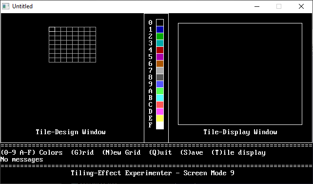

[Home](https://qb64.com) • [News](../../news.md) • [GitHub](https://github.com/QB64Official/qb64) • [Wiki](https://github.com/QB64Official/qb64/wiki) • [Samples](../../samples.md) • [InForm](../../inform.md) • [GX](../../gx.md) • [QBjs](../../qbjs.md) • [Community](../../community.md) • [More...](../../more.md)

## SAMPLE: TILE EXPERIMENT



### Author

[🐝 Greg Ennen](../greg-ennen.md) 

### Description

```text
' TILE.BAS
'   by Greg Ennen
' Copyright (C) 1995 DOS World
' Published in Issue #21, May 1995, page 57
```

### QBjs

> Please note that QBjs is still in early development and support for these examples is extremely experimental (meaning will most likely not work). With that out of the way, give it a try!

* [LOAD "tile.bas"](https://qbjs.org/index.html?src=https://qb64.com/samples/tile-experiment/src/tile.bas)
* [RUN "tile.bas"](https://qbjs.org/index.html?mode=auto&src=https://qb64.com/samples/tile-experiment/src/tile.bas)
* [PLAY "tile.bas"](https://qbjs.org/index.html?mode=play&src=https://qb64.com/samples/tile-experiment/src/tile.bas)

### File(s)

* [tile.bas](src/tile.bas)

🔗 [tile](../tile.md), [dos world](../dos-world.md)
