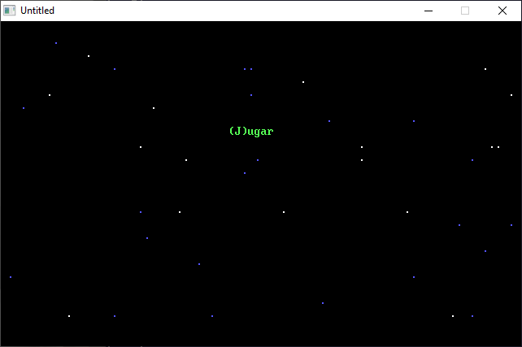

[Home](https://qb64.com) • [News](../../news.md) • [GitHub](https://github.com/QB64Official/qb64) • [Wiki](https://github.com/QB64Official/qb64/wiki) • [Samples](../../samples.md) • [InForm](../../inform.md) • [GX](../../gx.md) • [QBjs](../../qbjs.md) • [Community](../../community.md) • [More...](../../more.md)

## SAMPLE: TORNEO NDC



### Author

[🐝 FGR SOFTWARE](../fgr-software.md) 

### Description

```text
Ascii-based spaceship game with music.

'
'                               FGR SOFTWARE
'                                Torneo NDC
'
'=============================================================================
'Torneo NDC:
'Este juego intenta ser un juego al estilo galaxian, solo que muy pobre...
'Tiene 14 o 15 niveles, y es casi siemprelo mismo, solo que cambia el color
'de las naves enemigas (X), la dificultad, y se van acumulando las vidas y
'los puntajes...
'Las teclas son: A (para movernos a la izquierda)
'=============== S (para la derecha)
'                X (para disparar).
'
'=============================================================================
'
'Ya se que los comandos son un poco malos, pero sinceramente ya me canse de
'moverme con las flechas, y disparar con barra. Mi barra ya esta destrozada!
'Bueno, si tienen algun comentario o critica constructiva (no agresiones)
'escribanmen a fernandogastonramirez@yahoo.com.ar
'Visiten www.fgrqbasic.co.nr
'
'==============================================================================
```

### QBjs

> Please note that QBjs is still in early development and support for these examples is extremely experimental (meaning will most likely not work). With that out of the way, give it a try!

* [LOAD "torndc.bas"](https://qbjs.org/index.html?src=https://qb64.com/samples/torneo-ndc/src/torndc.bas)
* [RUN "torndc.bas"](https://qbjs.org/index.html?mode=auto&src=https://qb64.com/samples/torneo-ndc/src/torndc.bas)
* [PLAY "torndc.bas"](https://qbjs.org/index.html?mode=play&src=https://qb64.com/samples/torneo-ndc/src/torndc.bas)

### File(s)

* [torndc.bas](src/torndc.bas)

🔗 [game](../game.md), [legacy](../legacy.md)
