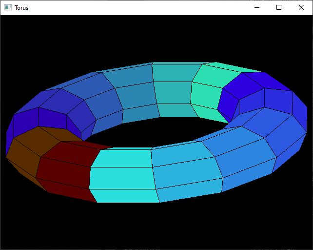

[Home](https://qb64.com) • [News](../../news.md) • [GitHub](https://github.com/QB64Official/qb64) • [Wiki](https://github.com/QB64Official/qb64/wiki) • [Samples](../../samples.md) • [InForm](../../inform.md) • [GX](../../gx.md) • [QBjs](../../qbjs.md) • [Community](../../community.md) • [More...](../../more.md)

## SAMPLE: TORUS DEMO



### Author

[🐝 Microsoft](../microsoft.md) 

### Description

```text
'-----------------------------------------------------------------------------------------------------
'                                TORUS
'   This program draws a Torus figure. The program accepts user input
'   to specify various TORUS parameters. It checks the current system
'   configuration and takes appropriate action to set the best possible
'   initial mode.
```

### QBjs

> Please note that QBjs is still in early development and support for these examples is extremely experimental (meaning will most likely not work). With that out of the way, give it a try!

* [LOAD "torus.bas"](https://qbjs.org/index.html?src=https://qb64.com/samples/torus-demo/src/torus.bas)
* [RUN "torus.bas"](https://qbjs.org/index.html?mode=auto&src=https://qb64.com/samples/torus-demo/src/torus.bas)
* [PLAY "torus.bas"](https://qbjs.org/index.html?mode=play&src=https://qb64.com/samples/torus-demo/src/torus.bas)

### File(s)

* [torus.bas](src/torus.bas)

🔗 [geometry](../geometry.md), [torus](../torus.md)
