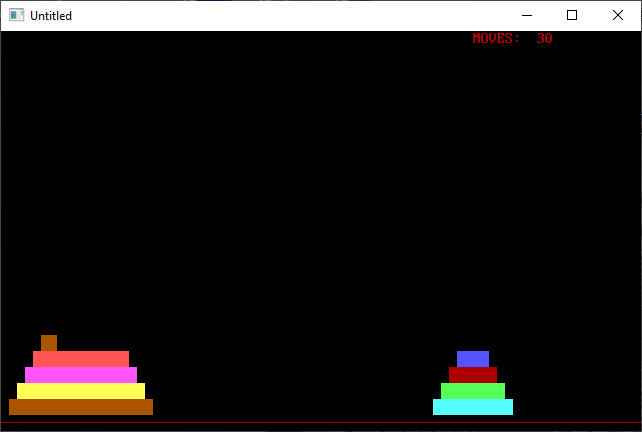

[Home](https://qb64.com) • [News](../../news.md) • [GitHub](https://github.com/QB64Official/qb64) • [Wiki](https://github.com/QB64Official/qb64/wiki) • [Samples](../../samples.md) • [InForm](../../inform.md) • [GX](../../gx.md) • [QBjs](../../qbjs.md) • [Community](../../community.md) • [More...](../../more.md)

## SAMPLE: TOWER OF HANOI



### Description

```text
Print "The TOWER OF HANOI is a mathematical game or puzzle. It consists"
Print "of three pegs and a number of discs which can slide onto any peg."
Print "The puzzle starts with the discs stacked in order of size on one peg."
```

### File(s)

* [tower.bas](src/tower.bas)
* [tower_orig.bas](src/tower_orig.bas)

🔗 [game](../game.md), [tower](../tower.md)
