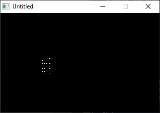

[Home](https://qb64.com) • [News](../../news.md) • [GitHub](https://github.com/QB64Official/qb64) • [Wiki](https://github.com/QB64Official/qb64/wiki) • [Samples](../../samples.md) • [InForm](../../inform.md) • [GX](../../gx.md) • [QBjs](../../qbjs.md) • [Community](../../community.md) • [More...](../../more.md)

## SAMPLE: VEKTOR



### Description

```text
Fly around a plane of dots.

PRINT "Welcome to my second go at displaying"
PRINT "points in a threedimentional space."
PRINT
PRINT "This program uses vectorcalculations"
PRINT "to calculate where a given point in"
PRINT "a virtual space should be placed on the"
PRINT "screen.  The math behind the program"
PRINT "could be disciphered by someone with a"
PRINT "lot of experience with math, and if you"
PRINT "are one, please feel free to do so and"
PRINT "use it in a program of your own."
PRINT
PRINT "I can't copyright math, after all."
PRINT
PRINT "But do give me credits...  :)"
PRINT
```

### QBjs

> Please note that QBjs is still in early development and support for these examples is extremely experimental (meaning will most likely not work). With that out of the way, give it a try!

* [LOAD "vektor.bas"](https://qbjs.org/index.html?src=https://qb64.com/samples/vektor/src/vektor.bas)
* [RUN "vektor.bas"](https://qbjs.org/index.html?mode=auto&src=https://qb64.com/samples/vektor/src/vektor.bas)
* [PLAY "vektor.bas"](https://qbjs.org/index.html?mode=play&src=https://qb64.com/samples/vektor/src/vektor.bas)

### File(s)

* [vektor.bas](src/vektor.bas)

🔗 [geometry](../geometry.md), [legacy](../legacy.md)
