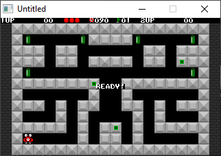

[Home](https://qb64.com) • [News](../../news.md) • [GitHub](https://github.com/QB64Official/qb64) • [Wiki](https://github.com/QB64Official/qb64/wiki) • [Samples](../../samples.md) • [InForm](../../inform.md) • [GX](../../gx.md) • [QBjs](../../qbjs.md) • [Community](../../community.md) • [More...](../../more.md)

## SAMPLE: WETSPOT



### Author

[🐝 Angelo Mottola](../angelo-mottola.md) 

### Description

```text
' WETSPOT v0.9
' by Angelo Mottola (C) 1996
'
' --------------------------------------------------------------------------
' Well, this is my first game written in QBASIC.
' Sorry, but I haven't so much time to add comments to this source, but
' I think it's pretty simple to understand.
' The target of this game is to kill every monster in less than 90 seconds
' to gain next level. You control a little crab, and you must push bricks
' towards your enemies to kill them. If you push a brick and besides it
' there is another one, the block you pushed on will be destroyed, maybe
' dropping a bonus. Bonuses are various, and someone has a particular
' function (For example: Lightning will destroy every monster on the screen).
' Not all bricks can be moved. Each level has three special blocks, and when
' you put them together, you gain a special multiplier bonus (2x or 3x if
' you put together two or three blocks).
' Look out for monsters that follow you and good luck!!
'
' Controls are:
'
'        Player One              Player Two                 General
'         Left:  4                Left:  A                  Pause: P
'         Right: 6                Right: D                  Quit:  ESC
'         Up:    8                Up:    W
'         Down:  5                Down:  S
'         Fire:  \                Fire:  ENTER
'
' Since this is not the final version, it contains only 21 levels.
' Final version will contain:
'
' - 100 levels (I hope so...)
' - 8 different enemies
' - Sound Blaster music and sound effects
'
' If you have any suggestion, mail me at
'
'                                ----------
'                                eri@cdc.it
'                                ----------
'
' --------------------------------------------------------------------------
```

### QBjs

> Please note that QBjs is still in early development and support for these examples is extremely experimental (meaning will most likely not work). With that out of the way, give it a try!

* [LOAD "wetspot.bas"](https://qbjs.org/index.html?src=https://qb64.com/samples/wetspot/src/wetspot.bas)
* [RUN "wetspot.bas"](https://qbjs.org/index.html?mode=auto&src=https://qb64.com/samples/wetspot/src/wetspot.bas)
* [PLAY "wetspot.bas"](https://qbjs.org/index.html?mode=play&src=https://qb64.com/samples/wetspot/src/wetspot.bas)

### File(s)

* [wetspot.bas](src/wetspot.bas)
* [wetspot.zip](src/wetspot.zip)

🔗 [game](../game.md), [legacy](../legacy.md)
