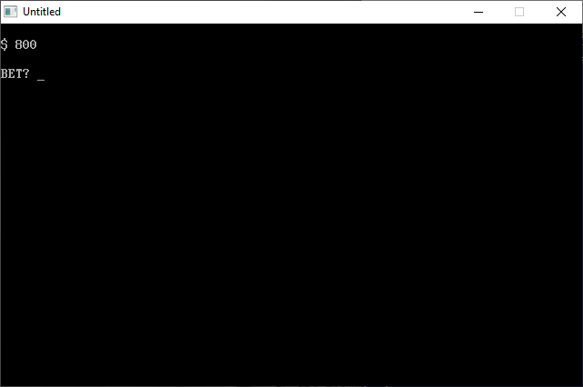

[Home](https://qb64.com) • [News](../../news.md) • [GitHub](https://github.com/QB64Official/qb64) • [Wiki](https://github.com/QB64Official/qb64/wiki) • [Samples](../../samples.md) • [InForm](../../inform.md) • [GX](../../gx.md) • [QBjs](../../qbjs.md) • [Community](../../community.md) • [More...](../../more.md)

## SAMPLE: WHEEL O



### Author

[🐝 Tom Sales](../tom-sales.md) 

### Description

```text
Copyright (C) 1994-95 DOS Resource Guide/DOS World 
Published in Issue #17, September 1994, page 66 and 
              Issue #20, March 1995, page 64 
 
It takes clever programming indeed to create an 
interesting one-line program. You'll be amazed at 
how much can be accomplished. 

WHEEL_O.BAS lets you try your luck at a wheel of fortune. The program starts  
you out with $1000 and prompts you for the amount you want to bet and the  
number between zero and nine that you think will come up. When you're right,  
your win is added to the pot; if you're wrong, the loss is subtracted. The  
nicest thing about this game, though, is that losing doesn't cost you  
anything.
```

### QBjs

> Please note that QBjs is still in early development and support for these examples is extremely experimental (meaning will most likely not work). With that out of the way, give it a try!

* [LOAD "wheel_o.bas"](https://qbjs.org/index.html?src=https://qb64.com/samples/wheel-o/src/wheel_o.bas)
* [RUN "wheel_o.bas"](https://qbjs.org/index.html?mode=auto&src=https://qb64.com/samples/wheel-o/src/wheel_o.bas)
* [PLAY "wheel_o.bas"](https://qbjs.org/index.html?mode=play&src=https://qb64.com/samples/wheel-o/src/wheel_o.bas)

### File(s)

* [wheel_o.bas](src/wheel_o.bas)

🔗 [game](../game.md), [dos world](../dos-world.md), [254 chars](../254-chars.md)
