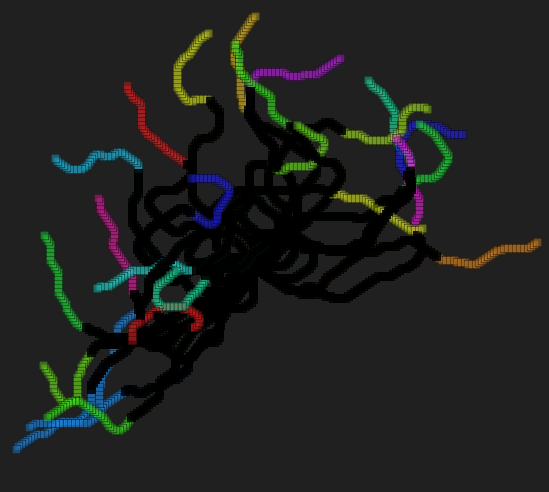

[Home](https://qb64.com) • [News](../../news.md) • [GitHub](https://github.com/QB64Official/qb64) • [Wiki](https://github.com/QB64Official/qb64/wiki) • [Samples](../../samples.md) • [InForm](../../inform.md) • [GX](../../gx.md) • [QBjs](../../qbjs.md) • [Community](../../community.md) • [More...](../../more.md)

## SAMPLE: WORMS



### Author

[🐝 Rho Sigma](../rho-sigma.md) 

### Description

```text
'+---------------+---------------------------------------------------+
'|_######_######_|_____.--._._________.-.____________________________|
'|_##__##_##___#_|_____|___)|________(___)_o_________________________|
'|_##__##__##____|_____|--'_|--._.-.__`-.__.__.-...--.--._.-.________|
'|_######___##___|_____|__\_|__|(___)(___)_|_(___||__|__|(___)_______|
'|_##______##____|_____'___`'__`-`-'__`-'-'_`-`-`|'__'__`-`-'`-______|
'|_##_____##___#_|____________________________._.'___________________|
'|_##_____######_|__Sources_&_Documents_placed_in_the_Public_Domain._|
'+---------------+---------------------------------------------------+
'|                                                                   |
'| === ScreenBlankers-Info.html ===                                  |
'|                                                                   |
'| == Some simple screen blankers I wrote using QB64.                |
'|                                                                   |
'+-------------------------------------------------------------------+
'| Done by RhoSigma, R.Heyder, provided AS IS, use at your own risk. |
'| Find me in the QB64 Forum or mail to support@rhosigma-cw.net for  |
'| any questions or suggestions. Thanx for your interest in my work. |
'+-------------------------------------------------------------------+
Screen Blankers
This is a small collection of some simple screen blanker modules. Most of them are written by myself, others were just graphic sample programs from other QB64 Forum members, which I've altered into a blanker module. Just read the header notes in each module for more information.

To install one of it (on a Windows system), simply rename the created .exe file with the new extension .scr, confirm the possible warning about changing the file extension with Yes. After that you can simply right click on the renamed file and choose Install.

Sorry, I've no idea how to do it on MacOS or Linux, any info about it from people who using these systems would be nice.
```

### QBjs

> Please note that QBjs is still in early development and support for these examples is extremely experimental (meaning will most likely not work). With that out of the way, give it a try!

* [LOAD "worms.bas"](https://qbjs.org/index.html?src=https://qb64.com/samples/worms/src/worms.bas)
* [RUN "worms.bas"](https://qbjs.org/index.html?mode=auto&src=https://qb64.com/samples/worms/src/worms.bas)
* [PLAY "worms.bas"](https://qbjs.org/index.html?mode=play&src=https://qb64.com/samples/worms/src/worms.bas)

### File(s)

* [worms.bas](src/worms.bas)

🔗 [screenblanker](../screenblanker.md)
