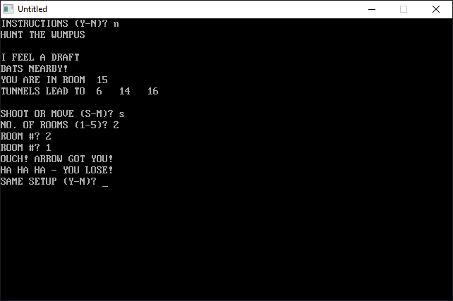

[Home](https://qb64.com) • [News](../../news.md) • [GitHub](https://github.com/QB64Official/qb64) • [Wiki](https://github.com/QB64Official/qb64/wiki) • [Samples](../../samples.md) • [InForm](../../inform.md) • [GX](../../gx.md) • [QBjs](../../qbjs.md) • [Community](../../community.md) • [More...](../../more.md)

## SAMPLE: WUMPUS



### Description

```text
375 REM *** INSTRUCTIONS ***
PRINT "WELCOME TO 'HUNT THE WUMPUS'"
PRINT " THE WUMPUS LIVES IN A CAVE OF 20 ROOMS. EACH ROOM"
PRINT "HAS 3 TUNNELS LEADING TO OTHER ROOMS. (LOOK AT A"
PRINT "DODECAHEDRON TO SEE HOW THIS WORKS-IF YOU DON'T KNOW"
PRINT "WHAT A DODECAHEDRON IS, ASK SOMEONE)"
```

### QBjs

> Please note that QBjs is still in early development and support for these examples is extremely experimental (meaning will most likely not work). With that out of the way, give it a try!

* [LOAD "wumpus.bas"](https://qbjs.org/index.html?src=https://qb64.com/samples/wumpus/src/wumpus.bas)
* [RUN "wumpus.bas"](https://qbjs.org/index.html?mode=auto&src=https://qb64.com/samples/wumpus/src/wumpus.bas)
* [PLAY "wumpus.bas"](https://qbjs.org/index.html?mode=play&src=https://qb64.com/samples/wumpus/src/wumpus.bas)

### File(s)

* [wumpus.bas](src/wumpus.bas)

🔗 [game](../game.md), [legacy](../legacy.md)
